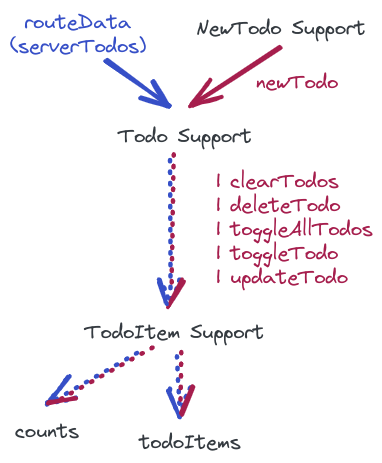

# SolidStart TodoMVC

A development-only port of [remix-todomvc](https://github.com/kentcdodds/remix-todomvc) ([license](https://github.com/kentcdodds/remix-todomvc/blob/main/LICENSE.md)) utilizing primitives and techniques supported directly by [SolidStart](https://start.solidjs.com/) and [SolidJS](https://www.solidjs.com/).

## Background

Despite the SolidStart repository already having its [own implementation](https://github.com/solidjs/solid-start/tree/main/examples/todomvc) of an optimistic UI [TodoMVC](https://todomvc.com/), in [Learning Angular w/ Minko Gechev](https://youtu.be/tfxxeknwsi8?t=12032) [remix-todomvc](https://github.com/kentcdodds/remix-todomvc) was presented as a sort of new gold standard.

Curiosity piqued, this sparked a journey of:
- [Scratch refactoring](https://xp123.com/articles/scratch-refactoring/) SolidStart's own TodoMVC [example](https://github.com/solidjs/solid-start/tree/main/examples/todomvc) to identify the primitives and techniques employed.
- Some familiarizaton with Remix via the [Jokes App Tutorial](https://remix.run/docs/en/v1/tutorials/jokes).
- Scratch refactoring [remix-todomvc](https://github.com/kentcdodds/remix-todomvc) to identify its approaches (leading to [remix-todomvc-kcd-v2](https://github.com/peerreynders/remix-todomvc-kcd-v2))

in preparation for implementing this (development-only) SolidStart variation.

---
```shell
$ cd solid-start-todomvc-kcd-v2
$ npm i

added 461 packages, and audited 462 packages in 3s

58 packages are looking for funding
  run `npm fund` for details

found 0 vulnerabilities
$ cp .env.example .env
$ npm run dev

> solid-start-todomvc-kcd-v2@0.0.0 dev
> solid-start dev

 solid-start dev 
 version  0.2.20
 adapter  node

  VITE v3.2.5  ready in 537 ms

  ➜  Local:   http://localhost:3000/
  ➜  Network: use --host to expose
  ➜  Inspect: http:/localhost:3000/__inspect/

  ➜  Page Routes:
     ┌─ http://localhost:3000/*todos
     ├─ http://localhost:3000/
     └─ http://localhost:3000/login

  ➜  API Routes:
     None! 👻

  > Server modules: 
   http://localhost:3000/_m/*
```

**Note**: The in-memory server side store re-seeds itself (johnsmith@outlook.com J0hn5M1th) whenever the `todos-persisted.json` file cannot be found.

---

> Everyone needs a framework; what everyone doesn't need is a general purpose framework. Nobody has a general problem, everyone has a very specific problem they're trying to solve. 

[Rasmus Lerdorf (2013)](https://youtu.be/anr7DQnMMs0?t=1917)

> Primitives not frameworks 

[Werner Vogels (2016)](https://www.allthingsdistributed.com/2016/03/10-lessons-from-10-years-of-aws.html#:~:text=Primitives%20not%20frameworks)

---
- [User Authentication](#user-authentication)
  - [Session Storage](#session-storage)
  - [Server Middleware](#server-middleware)
  - [User Context](#user-context)
  - [Login Page](#login-page)
    - [`makeLoginSupport`](#make-login-support)
    - [Login function (server side)](#login-fn)
- [Progressive Enhancement](#progressive-enhancement)
  - [Server-Only Considerations](#server-only-considerations)
    - [Errors](#server-only-errors)
- [Optimistic UI](#optimistic-ui)
  - [Server Error Types](#server-error-types)
  - [NewTodo Support](#new-todo-support)
    - [`makeNewTodoSupport`](#make-new-todo-support)
    - [`makeNewTodoState`](#make-new-todo-state)
    - [NewTodo function (server side)](#new-todo-fn)
  - [Todo Support](#todo-support)
    - [`makeTodoSupport`](#make-todo-support)
    - [`makeTodoComposer`](#make-todo-composer)
    - [TodoAction function (server side)](#todo-action-fn)
  - [Todo Item Support](#todo-item-support)
    - [`makeTodoItemSupport`](#make-todo-item-support)

## User Authentication

### Session Storage

Once a user has been successfully authenticated that authentication is maintained on the server across multiple client requests with the [`Set-Cookie`](https://developer.mozilla.org/en-US/docs/Web/HTTP/Headers/Set-Cookie) header.
In SolidStart that (cookie) session storage is created with [`createCookieSessionStorage`](https://start.solidjs.com/api/createCookieSessionStorage).

```TypeScript
// file: src/server/session.ts

if (!process.env.SESSION_SECRET) throw Error('SESSION_SECRET must be set');

const storage = createCookieSessionStorage({
  cookie: {
    name: '__session',
    secure: process.env.NODE_ENV === 'production',
    secrets: [process.env.SESSION_SECRET],
    sameSite: 'lax',
    path: '/',
    maxAge: 0,
    httpOnly: true,
  },
});

const fromRequest = (request: Request): Promise<Session> =>
  storage.getSession(request.headers.get('Cookie'));

const USER_SESSION_KEY = 'userId';
const USER_SESSION_MAX_AGE = 60 * 60 * 24 * 7; // 7 days

async function createUserSession({
  request,
  userId,
  remember,
  redirectTo,
}: {
  request: Request;
  userId: User['id'];
  remember: boolean;
  redirectTo: string;
}): Promise<Response> {
  const session = await fromRequest(request);
  session.set(USER_SESSION_KEY, userId);

  const maxAge = remember ? USER_SESSION_MAX_AGE : undefined;
  const cookieContent = await storage.commitSession(session, { maxAge });

  return redirect(safeRedirect(redirectTo), {
    headers: {
      'Set-Cookie': cookieContent,
    },
  });
}
```

The `SESSION_SECRET` used by the session storage is kept in a `.env` file, e.g.:
```
# file: .env
SESSION_SECRET="Xe005osOAE8ZRMDReizQJjlLrrs=" 
```

so that in [Node.js](https://nodejs.org/) it can be read with [`process.env`](https://nodejs.org/dist/latest-v8.x/docs/api/process.html#process_process_env).

Some of the `cookie` (default) options:
- `name` sets the the cookie [name/key](https://developer.mozilla.org/en-US/docs/Web/HTTP/Headers/Set-Cookie#cookie-namecookie-value).
- `Max-Age=0` [expires](https://developer.mozilla.org/en-US/docs/Web/HTTP/Headers/Set-Cookie#max-agenumber) the cookie immediately ([overridden](#cookie-age) during `storage.commitSession(…)`).
- `HttpOnly=true` [forbids](https://developer.mozilla.org/en-US/docs/Web/HTTP/Headers/Set-Cookie#httponly) JavaScript from accessing the cookie.

The cookie is returned in a [Cookie](https://developer.mozilla.org/en-US/docs/Web/HTTP/Headers/Cookie) header on request the follow a response with the [`Set-Cookie`](https://developer.mozilla.org/en-US/docs/Web/HTTP/Headers/Set-Cookie) header.
Consequently it can be accessed on the server via the [`Headers`](https://developer.mozilla.org/en-US/docs/Web/API/Headers) object exposed by [`Request.headers`](https://developer.mozilla.org/en-US/docs/Web/API/Request/headers) with `request.headers.get('Cookie')`. 

The request's cookie value is used to find/reconstitute the user session (or create a new one) in the server side session storage with `storage.getSession(…)` in `fromRequest`.
`createUserSession(…)` writes the `userId` to the newly created session with `session.set('userId', userId);`; `storage.commitSession(session, { maxAge })` commits the session to storage while generating a cookie value for the `Set-Cookie` response header that makes it possible to find/reconstitute the server side user session on the next request.  

<a name="cookie-age"></a>
`maxAge` will either be 7 days ([permanent cookie](https://developer.mozilla.org/en-US/docs/Web/HTTP/Headers/Set-Cookie#permanent_cookie)) or (if `undefined`) create a [session cookie](https://developer.mozilla.org/en-US/docs/Web/HTTP/Headers/Set-Cookie#session_cookie) which is removed once the browser terminates.

Finally [`redirect(…)`](https://start.solidjs.com/api/redirect) is used to move to the next address and to attach the `Set-Cookie` header to the response.


`storage.destroySession(…)` is used purge the user session. 
Again it generates the cookie content to be set with a `Set-Cookie` header in the response.
Cookies are typically deleted by the server by setting its [`Expires`](https://developer.mozilla.org/en-US/docs/Web/HTTP/Headers/Set-Cookie#expiresdate) attribute to the [ECMAScript Epoch](https://developer.mozilla.org/en-US/docs/Web/JavaScript/Reference/Global_Objects/Date#the_ecmascript_epoch_and_timestamps) (or any other date in the past): 

<details><summary>code</summary>

```TypeScript
const formatter = Intl.DateTimeFormat(['ja-JP'], {
  hourCycle: 'h23',
  year: 'numeric',
  month: '2-digit',
  day: '2-digit',
  hour: '2-digit',
  minute: '2-digit',
  second: '2-digit',
  timeZone: 'UTC',
  timeZoneName: 'short',
});
const epoch = new Date(0);
console.log(epoch.toISOString());     // 1970-01-01T00:00:00.000Z
console.log(formatter.format(epoch)); // 1970/01/01 00:00:00 UTC
```

</details>

or by setting the [`Max-Age`](https://developer.mozilla.org/en-US/docs/Web/HTTP/Headers/Set-Cookie#max-agenumber) attribute to zero or a negative number. The `logout` function uses this to purge the user session cookie from the browser ([caveat](https://developer.mozilla.org/en-US/docs/Web/HTTP/Headers/Set-Cookie#sect3)).


```TypeScript
// file: src/server/session.ts

async function logout(request: Request, redirectTo = loginHref()) {
  const session = await fromRequest(request);
  const cookieContent = await storage.destroySession(session);

  return redirect(redirectTo, {
    headers: {
      'Set-Cookie': cookieContent,
    },
  });
}

```

### Server Middleware

Once the user session cookie exists in the request there is an opportunity to make the session values easily available to most server side code. Server [middleware](https://start.solidjs.com/advanced/middleware) is passed a [`FetchEvent`](https://github.com/solidjs/solid-start/blob/121d45d27be519bad3e2fc9f9c895dc64f7a0d3d/packages/start/server/types.tsx#L59-L64) which contains among other things the `request` but also a `locals` collection.

In this case `getUser(…)` is used to extract the user ID from the request cookie which is then used to retrieve the remainder of the user information with `selectUserById(…)` from persistent storage:

```TypeScript
// file src/server/session.ts

const getUserId = async (request: Request) =>
  (await fromRequest(request)).get(USER_SESSION_KEY);

async function getUser(request: Request) {
  const userId = await getUserId(request);
  return typeof userId === 'string' ? selectUserById(userId) : undefined;
}
```
That information is then stored for later, synchronous access in `FetchEvent`'s `locals` collection under the `user` key. 

```TypeScript
// file: src/entry-server.tsx

function todosMiddleware({ forward }: MiddlewareInput): MiddlewareFn {
  return async (event) => {
    const route = new URL(event.request.url).pathname;
    if (route === logoutHref)
      return logout(event.request, loginHref(todosHref));

    // Attach user to FetchEvent if available
    const user = await getUser(event.request);
    if (user) event.locals['user'] = user;

    // Protect the `/todos[/{filter}]` URL
    // undefined ➔  unrelated URL 
    //   (should be `...todos` at this point)
    // true ➔  valid "todos" URL
    // false ➔  starts with `/todos` but otherwise wrong
    //
    const toTodos = isValidTodosHref(route);
    if (toTodos === false) {
      if (user) return redirect(todosHref);

      return redirect(loginHref(todosHref));
    }

    return forward(event);
  };
}

export default createHandler(
  todosMiddleware,
  renderAsync((event) => <StartServer event={event} />)
);
```

Conversely absense of a `user` value on the `FetchEvent`'s `locals` can be interpreted as the absense of a user session and authentication typically requiring a redirect to the login page.

Some helper functions used:
```TypeScript
// file: src/route-path.ts

const homeHref = '/';

function loginHref(redirectTo?: string) {
  const href = '/login';
  if (!redirectTo || redirectTo === homeHref) return href;

  const searchParams = new URLSearchParams([['redirect-to', redirectTo]]);
  return `${href}?${searchParams.toString()}`;
}

const todosHref = '/todos';

/* … more code … */

const todosPathSegments = new Set(['/', '/active', '/all', '/complete']);

function isValidTodosHref(pathname: string) {
  if (!pathname.startsWith(todosHref)) return undefined;

  if (pathname.length === todosHref.length) return true;

  return todosPathSegments.has(pathname.slice(todosHref.length));
}
```

### User Context

A [`server$`](https://start.solidjs.com/api/server) server side function has access to the `locals` collection via the [`ServerFunctionEvent`](https://github.com/solidjs/solid-start/blob/121d45d27be519bad3e2fc9f9c895dc64f7a0d3d/packages/start/server/types.tsx#L66-L69) that is passed as the [function context](https://developer.mozilla.org/en-US/docs/Web/JavaScript/Reference/Operators/this#function_context) (TS: [Declaring `this` in a function](https://www.typescriptlang.org/docs/handbook/2/functions.html#declaring-this-in-a-function)):

```TypeScript
// file: src/components/user-context.tsx 

function userFromSession(this: ServerFunctionEvent) {
  return userFromFetchEvent(this);
}
```

```TypeScript
// file: src/server/helpers.ts

const userFromFetchEvent = (event: FetchEvent) =>
  'user' in event.locals && typeof event.locals.user === 'object'
    ? (event.locals.user as User | undefined)
    : undefined;
```

Using [`server$`](https://start.solidjs.com/api/server) the browser can send a request to the server which then returns the user information placed by the [server middleware](#server-middleware) on the `FetchEvent` back to the browser. 

```TypeScript
// file: src/components/user-context.tsx 

const clientSideSessionUser = server$(userFromSession);

const userEquals = (prev: User, next: User) =>
  prev.id === next.id && prev.email === next.email;

const userChanged = (prev: User | undefined, next: User | undefined) => {
  const noPrev = typeof prev === 'undefined';
  const noNext = typeof next === 'undefined';

  // Logical XOR - only one is undefined
  if (noPrev ? !noNext : noNext) return true;

  // Both undefined or User
  return noPrev ? false : !userEquals(prev, next as User);
};

function makeSessionUser(isRouting: () => boolean) {
  let routing = false;
  let toggle = 0;

  const refreshUser = () => {
    const last = routing;
    routing = isRouting();
    if (last || !routing) return toggle;

    // isRouting: false ➔  true transition
    // Toggle source signal to trigger user fetch
    toggle = 1 - toggle;
    return toggle;
  };

  const fetchUser = async (
    _toggle: number,
    { value }: { value: User | undefined; refetching: boolean | unknown }
  ) => {
    const next = await (isServer
      ? userFromFetchEvent(useServerContext())
      : clientSideSessionUser());

    // Maintain referential stability if
    // contents doesn't change
    return userChanged(value, next) ? next : value;
  };

  const [userResource] = createResource<User | undefined, number>(
    refreshUser,
    fetchUser
  );

  return userResource;
}
```

`makeSessionUser(…)` creates a [resource](https://www.solidjs.com/docs/latest#createresource) to (reactively) make the information from the user session available. 
It works slightly differently on server and client based on [`isServer`](https://www.solidjs.com/docs/latest#isserver); on the server (for SSR) `userFromFetchEvent(…)` can be used directly while the client has to access it indirectly via `clientSideSessionUser()`.

The `refreshUser()` [derived signal](https://www.solidjs.com/tutorial/introduction_derived) drives the updates of `userResource` (acting as the [`sourceSignal`](https://www.solidjs.com/docs/latest/api#createresource)). Whenever the route changes (client side) the return value of `refreshUser()` changes (either `0` or `1`) causing the resource to fetch the user information again from the server (in case the route change caused the creation or removal of a user session). 
[`useIsRouting()`](https://start.solidjs.com/api/useIsRouting) can only be used "in relation" to [`Routes`](https://start.solidjs.com/api/Routes), making it necessary to pass in the `isRouting()` signal as a parameter to `makeSessionUser(…)`.

The purpose of the *User Context* is to make the [User](src/server/types.ts) information available page wide without [nested routes](https://start.solidjs.com/core-concepts/routing#nested-routes) having to acquire it separately via their [`routeData`](https://start.solidjs.com/api/useRouteData) function.
So the `userResource` is made accessible by placing it in a [context](https://www.solidjs.com/docs/latest/api#createcontext).

```TypeScript
// file: src/components/user-context.tsx 

const UserContext = createContext<Resource<User | undefined> | undefined>();

export type Props = ParentProps & {
  isRouting: () => boolean;
};

function UserProvider(props: Props) {
  return (
    <UserContext.Provider value={makeSessionUser(props.isRouting)}>
      {props.children}
    </UserContext.Provider>
  );
}

const useUser = () => useContext(UserContext);
```

The [`isRouting()`](https://start.solidjs.com/api/useIsRouting) signal necessary for `makeSessionUser(…)` is injected into the provider, making `userResource` available to all the `children` via the `useUser()` hook.

The `UserProvider` is used in the document entry point (top level layout) [`root.tsx`](https://start.solidjs.com/api/root) to enable the `useUser()` hook in the rest of the document. 

```TypeScript
// file: src/root.tsx 

import { UserProvider } from './components/user-context';

export default function Root() {
  const isRouting = useIsRouting();

  return (
    <Html lang="en">
      <Head>
        <Title>SolidStart TodoMVC</Title>
        <Meta charset="utf-8" />
        <Meta name="viewport" content="width=device-width, initial-scale=1" />
        <link href="/styles.css" rel="stylesheet" />
      </Head>
      <Body>
        <Suspense>
          <ErrorBoundary>
            <UserProvider isRouting={isRouting}>
              <Routes>
                <FileRoutes />
              </Routes>
            </UserProvider>
          </ErrorBoundary>
        </Suspense>
        <Scripts />
      </Body>
    </Html>
  );
}
```

For example, the top level index route uses `useUser()` to decide to whether to [`Navigate`](https://start.solidjs.com/api/Navigate) to `/login` or `/todos`:

```TypeScript
// file: src/routes/index.tsx 

import { Show } from 'solid-js';
import { Navigate } from 'solid-start';
import { loginHref, todosHref } from '~/route-path';
import { useUser } from '~/components/user-context';

export default function RedirectPage() {
  return (
    <Show
      when={useUser()?.()}
      fallback={<Navigate href={loginHref(todosHref)} />}
    >
      <Navigate href={todosHref} />
    </Show>
  );
}
```

### Login Page

#### `makeLoginSupport`
<a name="make-login-support"></a>

The login functionality uses [forms](https://developer.mozilla.org/en-US/docs/Learn/Forms) furnished by [`createServerAction$(…)`](https://start.solidjs.com/api/createServerAction):

```TypeScript
// file: src/routes/login.tsx 

function makeLoginSupport() {
  const [loggingIn, login] = createServerAction$(loginFn);

  const emailError = () =>
    loggingIn.error?.fieldErrors?.email as string | undefined;
  const passwordError = () =>
    loggingIn.error?.fieldErrors?.password as string | undefined;

  const focusId = () => (passwordError() ? 'password' : 'email');

  return {
    emailError,
    focusId,
    login,
    passwordError,
  };
}
```

`login` is the action dispatcher that exposes the form action while `loggingIn` is an action monitor that reactively tracks submission state. 
The `emailError` and `passwordError` derived signals factor out the two possible action error sources. 
`focusId` is used to determine autofocus which defaults to the email field unless there is a password error. 

Auxiliary functions for the JSX:

```TypeScript
const emailHasError = (emailError: () => string | undefined) =>
  typeof emailError() !== undefined;

const emailInvalid = (emailError: () => string | undefined) =>
  emailError() ? true : undefined;

const emailErrorId = (emailError: () => string | undefined) =>
  emailError() ? 'email-error' : undefined;

const passwordHasError = (passwordError: () => string | undefined) =>
  typeof passwordError() !== undefined;

const passwordInvalid = (passwordError: () => string | undefined) =>
  passwordError() ? true : undefined;

const passwordErrorId = (passwordError: () => string | undefined) =>
  passwordError() ? 'password-error' : undefined;

const hasAutofocus = (id: string, focusId: Accessor<string>) =>
  focusId() === id;
```

The `login` action dispatcher, `emailError`, `passwordError`, and `focusId` signals are exposed to the `LoginPage`. 
A separate [effect](https://www.solidjs.com/docs/latest/api#createeffect) is used to redirect focus on a client side password error.
[`ref`](https://www.solidjs.com/docs/latest/api#ref)s on the respective [`HTMLInputElement`](https://developer.mozilla.org/en-US/docs/Web/API/HTMLInputElement)s are used to support that effect.


There are two different `kind`s of actions: `login` and `signup` (see `button`s).

```TypeScript
// file: src/routes/login.tsx 

export default function LoginPage() {
  const [searchParams] = useSearchParams();
  const redirectTo = searchParams['redirect-to'] || todosHref;
  const { login, focusId, emailError, passwordError } = makeLoginSupport();

  let emailInput: HTMLInputElement | undefined;
  let passwordInput: HTMLInputElement | undefined;

  createEffect(() => {
    if (focusId() === 'password') {
      passwordInput?.focus();
    } else {
      emailInput?.focus();
    }
  });

  return (
    <div class="c-login">
      <Title>Login</Title>
      <h1 class="c-login__header">TodoMVC Login</h1>
      <div>
        <login.Form class="c-login__form">
          <div>
            <label for="email">Email address</label>
            <input
              ref={emailInput}
              id="email"
              class="c-login__email"
              required
              autofocus={hasAutofocus('email', focusId)}
              name="email"
              type="email"
              autocomplete="email"
              aria-invalid={emailInvalid(emailError)}
              aria-errormessage={emailErrorId(emailError)}
            />
            <Show when={emailHasError(emailError)}>
              <div id="email-error">{emailError()}</div>
            </Show>
          </div>

          <div>
            <label for="password">Password</label>
            <input
              ref={passwordInput}
              id="password"
              class="c-login__password"
              autofocus={hasAutofocus('password', focusId)}
              name="password"
              type="password"
              autocomplete="current-password"
              aria-invalid={passwordInvalid(passwordError)}
              aria-errormessage={passwordErrorId(passwordError)}
            />
            <Show when={passwordHasError(passwordError)}>
              <div id="password-error">{passwordError()}</div>
            </Show>
          </div>
          <input type="hidden" name="redirect-to" value={redirectTo} />
          <button type="submit" name="kind" value="login">
            Log in
          </button>
          <button type="submit" name="kind" value="signup">
            Sign Up
          </button>
          <div>
            <label for="remember">
              <input
                id="remember"
                class="c-login__remember"
                name="remember"
                type="checkbox"
              />{' '}
              Remember me
            </label>
          </div>
        </login.Form>
      </div>
    </div>
  );
}
```

#### Login function (server side)
<a name="login-fn"></a>

`loginFn` extracts `kind`, `email`, and `password` from the [`FormData`](https://developer.mozilla.org/en-US/docs/Web/API/FormData) and subjects them to various validations:

```TypeScript
// file: src/routes/login.tsx 

function forceToString(formData: FormData, name: string) {
  const value = formData.get(name);
  return typeof value === 'string' ? value : '';
}

async function loginFn(
  form: FormData,
  event: ServerFunctionEvent
) {
  const email = forceToString(form, 'email');
  const password = forceToString(form, 'password');
  const kind = forceToString(form, 'kind');

  const fields = {
    email,
    password,
    kind,
  };

  if (!validateEmail(email))
    throw makeError({ error: 'email-invalid', fields });

  if (password.length < 1)
    throw makeError({ error: 'password-missing', fields });
  if (password.length < 8) throw makeError({ error: 'password-short', fields });

  if (kind === 'signup') {
    const found = await selectUserByEmail(email);
    if (found) throw makeError({ error: 'email-exists', fields });
  } else if (kind !== 'login')
    throw makeError({ error: 'kind-unknown', fields });

  const user = await (kind === 'login'
    ? verifyLogin(email, password)
    : insertUser(email, password));

  if (!user) throw makeError({ error: 'user-invalid', fields });

  const redirectTo = form.get('redirect-to');
  const remember = form.get('remember');
  return createUserSession({
    request: event.request,
    userId: user.id,
    remember: remember === 'on',
    redirectTo: typeof redirectTo === 'string' ? redirectTo : todosHref,
  });
}
```
… which could result in any number of errors which will appear on the corresponding fields:

```TypeScript
type FieldError =
  | 'email-invalid'
  | 'email-exists'
  | 'password-missing'
  | 'password-short'
  | 'user-invalid'
  | 'kind-unknown';

function makeError(data?: {
  error: FieldError;
  fields: {
    email: string;
    password: string;
    kind: string;
  };
}) {
  let message = 'Form not submitted correctly.';
  if (!data) return new FormError(message);

  let error = data.error;
  const fieldErrors: {
    email?: string;
    password?: string;
  } = {};

  switch (error) {
    case 'email-invalid':
      message = fieldErrors.email = 'Email is invalid';
      break;

    case 'email-exists':
      message = fieldErrors.email = 'A user already exists with this email';
      break;

    case 'user-invalid':
      message = fieldErrors.email = 'Invalid email or password';
      break;

    case 'password-missing':
      message = fieldErrors.password = 'Password is required';
      break;

    case 'password-short':
      message = fieldErrors.password = 'Password is too short';
      break;

    case 'kind-unknown':
      return new Error(`Unknown kind: ${data.fields.kind}`);

    default: {
      const _exhaustiveCheck: never = error;
      error = _exhaustiveCheck;
    }
  }

  return new FormError(message, { fields: data.fields, fieldErrors });
}
```
(TS: [Exhaustiveness checking](https://www.typescriptlang.org/docs/handbook/2/narrowing.html#exhaustiveness-checking); an `Error` maps to an [500 Internal Server Error](https://developer.mozilla.org/en-US/docs/Web/HTTP/Status/500) response status while a `FormError` maps to a [400 Bad Request](https://developer.mozilla.org/en-US/docs/Web/HTTP/Status/400) response status)

If all checks are passed `signup` will add the new user while `login` will verify an existing user. 
In either case a user session ([Session Storage](#session-storage)) is created giving access to the `/todos` route.


## Progressive Enhancement

[Progressive Enhancement](https://alistapart.com/article/understandingprogressiveenhancement/) (PE) was coined in 2003 as a term to describe the web's approach to resiliance and fault tolerance; as put by Aaron Gustafson in [Adaptive Web Design](https://adaptivewebdesign.info/2nd-edition/) (2015):
1. Content is the foundation
2. Markup is an enhancement (HTML)
3. Visual Design is an Enhancement (CSS)
4. Interaction is an Enhancement (JavaScript)

(In 2016 Jake Archibald added [*5. The Network is an Enhancement*](https://youtu.be/qDJAz3IIq18?&t=215) for [PWAs](https://web.dev/progressive-web-apps) ([Service Worker API](https://developer.mozilla.org/en-US/docs/Web/API/Service_Worker_API))).

In 2013 [Tom Dale](https://twitter.com/tomdale) declared PE as dead with [Progressive Enhancement: Zed’s Dead, Baby](https://tomdale.net/2013/09/progressive-enhancement-is-dead/). 
While that notion has been repeatedly challenged since then ([Everyone has JavaScript, right?](https://www.kryogenix.org/code/browser/everyonehasjs.html), [Why availability matters](https://www.kryogenix.org/code/browser/why-availability/)) the shift towards [SPAs](https://web.dev/vitals-spa-faq/) has diverted the industry's attention away from PE for the longest time.

However over that past few years the web is being increasingly accessed with [resource-constrained devices](https://youtu.be/TsTt7Tja30Q?t=12) ([The Performance Inequality Gap, 2023](https://infrequently.org/2022/12/performance-baseline-2023/)) and at times under [less than perfect conditions](https://csswizardry.com/2017/11/the-fallacies-of-distributed-computing-applied-to-front-end-performance/). 

One of the qualities that makes the web so attractive is ***its reach***. 
To preserve that reach it has become necessary to be less demanding and reliant on the computational power of client devices and the quality of the connection to them.  

The idea behind progressive enhancement is to provide a [minimum viable experience](https://andy-bell.co.uk/how-a-minimum-viable-experience-produces-a-resilient-inclusive-end-product/) when conditions are less than ideal. 
However when capabilities in excess of the minimum are available, they are used to ***enhance*** the user experience. 

All *SolidStart TodoMVC* interactivity is based on [forms](https://developer.mozilla.org/en-US/docs/Learn/Forms) so it can operate without client side JavaScript. 
But when JavaScript can be loaded, it is used to support an [optimistic UI](#optimistic-ui) that can improve the user experience over a slow network.

For a demonstration:

1. Start up the development server: `npm run dev`
2. Open an incognito window (or your browser's equivalent)
3. Open DevTools with `Ctrl(Cmd)+Shift+C`
4. Open the Command Menu with `Ctrl(Cmd)+Shift+P`
5. Type `javascript` and click on `Disable JavaScript` to disable JavaScript
6. Click on the "Network" tab and select "Slow 3G" on the "Throttling" dropdown
7. Open `http://localhost:3000/`

Eventually the login page opens.
Log in with `johnsmith@outlook.com` and `J0hn5M1th`.

The application navigates to `\todos`. Enter "new todo" and press `Enter`. 
Eventually the "new todo" disappears from the entry area and appears on top of the todo list as a new todo item after a page reload.

Move to the right area of the new todo item and click on ❌ "Delete Todo". 
Again it takes a while but eventually the "new todo" item vanishes after a page reload. 
Finally log out (click "Logout" at the bottom of the page to the right of "johnsmith @outlook.com").

This establishes the *minimum viable experience* for SolidStart TodoMVC when both JavaScript isn't available and connectivity is slow. Now lets re-enable JavaScript:

1. Open the Command Menu with `Ctrl(Cmd)+Shift+P`
2. Type `javascript` and click on `Enable JavaScript` to enable JavaScript
3. Reload `http://localhost:3000/`

Given that this is a development run [Vite](https://vitejs.dev/) will load *a lot* of additional JavaScript.
Once loading has completed repeat the above session but don't log out.

Given that the connection speed hasn't improved transition to `\todos` still is slow. 
However adding and deleting the "new todo" is a lot snappier with JavaScript despite the fact that the connection speed to the server is still poor. 

This is an example of *progessive enhancement* as JavaScript, once it is available, is used to compensate for the poor connection speed to improve the user experience while absence of JavaScript doesn't cripple the application.

Given that the UI is ***optimistic*** there can be surprising behaviour. 
Type "error" in the entry area and press `Enter`.
Initially "error" will move to the top of the todo list (the UI assumes that that the new todo will be successfully added) but "error" then disappears from the list and is moved back to the entry area after the server returns the error message “Todos cannot include the word "error"” .

### Server-Only Considerations

The `/login` page works out of the box for server-only, no-client-side-javascript operation. 
That page only uses [`createServerAction$(…)`](https://start.solidjs.com/api/createServerAction).

`/todos` on the other hand uses [`createServerMultiAction$(…)`](https://start.solidjs.com/api/createServerMultiAction) which requires a little bit of hand-holdling (perhaps reflecting the state of the SolidStart **Beta** and/or the lack of breadth/depth of my knowledge of it).

Wherever `todoAction.Form` is used 

```JSX
<input
  type="hidden"
  name="redirect-to"
  value={location.pathname}
/>
```

is included (`location` is the result from [`useLocation(…)`](https://start.solidjs.com/api/useLocation)). 

This ensures that during SSR the path of the rendered page is embedded into the [`FormData`](https://developer.mozilla.org/en-US/docs/Web/API/FormData).

But each usage of `todoAction.Form` looks like this:

```JSX
<todoAction.Form onsubmit={todoActionSubmitListener}>
  { /* … */ }
<todoAction.Form>
```

referring to 

```TypeScript
// file" src/routes/[...todos].tsx

function todoActionSubmitListener(event: SubmitEvent) {
  const form = event.currentTarget;
  if (!(form instanceof HTMLFormElement)) return;

  const redirectTo = form.querySelector('input[name="redirect-to"]');
  if (!(redirectTo instanceof HTMLInputElement)) return;

  // Clear redirect to suppress redirect
  // and get a result for the submission
  redirectTo.value = '';
}
```

so that a page with-JavaScript will clear the `redirect-to` field on submit while a page without-JavaScript will leave the SSR `pathname` intact.

At the end of a server side action function we can now:

```TypeScript
  // … 
  return todoActionResponse(redirectTo, 'updateTodo', id);
},
```
using

```TypeScript
// file" src/routes/[...todos].tsx

const todoActionResponse = (
  redirectTo: string,
  kind: TodoActionKind,
  id: string
) =>
  redirectTo.length > 0
    ? redirect(redirectTo)
    : json({ kind, id } as TodoActionResult);
```

This way non-JavaScript pages will always get a [*redirect*](https://developer.mozilla.org/en-US/docs/Web/HTTP/Redirections) response to re-render themselves reflecting their new state while pages running JavaScript are sent a JSON result that becomes the action's `submission` result that indicates that the submission has completed (which is essential to the correct operation of [`makeNewTodoSupport`](#make-new-todo-support) and [`makeTodoSupport`](#make-todo-support)).

#### Errors
<a name="server-only-errors"></a>

Errors for server-only [`createServerMultiAction$(…)`](https://start.solidjs.com/api/createServerMultiAction) `submission`s have a problem: there is no client side `submission` to return the error to! 
[`createServerAction$(…)`](https://start.solidjs.com/api/createServerAction) doesn't have this problem because it can only support one single *pending* submission.

`createServerMultiAction$(…)` was designed to handle multiple `submission`s and the error only applies to one of them (… though server-only effectively constrains it to one single submission).

Currently SolidState serializes and encodes such an error to the [URL parameters](https://developer.mozilla.org/en-US/docs/Learn/Common_questions/Web_mechanics/What_is_a_URL#parameters).

```TypeScript
// file" src/routes/[...todos].tsx

function Todos() {
  const pageError = isServer ? decodePageError() : undefined;

  const location = useLocation();

  // …
```

i.e. the `pageError` is only captured during SSR.

```TypeScript
// file" src/helpers.ts

function entriesToFormData(entries: unknown) {
  if (!Array.isArray(entries)) return;

  const formData = new FormData();
  for (const [name, value] of entries) {
    if (typeof name === 'string' && typeof value === 'string')
      formData.append(name, value);
  }
  return formData;
}

function dataToError(data: unknown) {
  if (!data || typeof data !== 'object' || !Object.hasOwn(data, 'message'))
    return;
  const message = (data as { message?: string })?.message;

  if (typeof message !== 'string') return;

  if (message.toLowerCase().startsWith('internal server error'))
    return new Error(message);

  const formError = (data as { formError?: string })?.formError;
  if (!formError || typeof formError !== 'string')
    return new ServerError(message);

  const fields = (data as { fields?: { [key: string]: string } })?.fields;
  const fieldErrors = (data as { fieldErrors?: { [key: string]: string } })
    ?.fieldErrors;
  const options: Partial<{
    fields: { [key: string]: string };
    fieldErrors: { [key: string]: string };
  }> = {};

  if (fields && typeof fields === 'object') options.fields = fields;

  if (fieldErrors && typeof fieldErrors === 'object')
    options.fieldErrors = fieldErrors;

  return new FormError(formError, options);
}

export type SsrPageError = [formData: FormData, error: Error];

function decodePageError() {
  let result: SsrPageError | undefined;
  try {
    const event = useServerContext();
    const raw = new URL(event.request.url).searchParams.get('form');
    if (typeof raw !== 'string') return result;

    const data = JSON.parse(raw);
    const error = dataToError(data?.error);
    const formData = entriesToFormData(data?.entries);
    if (error instanceof Error && formData instanceof FormData)
      result = [formData, error];
  } catch (_e) {
    // eslint-disable-line no-empty
  }

  return result;
}
```

Once the error is reconstituted (during SSR) it can be forwarded to the logic that would (potentially) normally process it, e.g.:

```TypeScript
// file" src/routes/[...todos].tsx

function Todos() {
  const pageError = isServer ? decodePageError() : undefined;

  // …

  const newTodos = makeNewTodoSupport(pageError);
  const { createTodo, showNewTodo, toBeTodos } = newTodos;

  // …

function makeNewTodoSupport(pageError?: SsrPageError) {
  const [creatingTodo, createTodo] = createServerMultiAction$(newTodoFn);

  const state = makeNewTodoState(pageError);

  // …

function makeNewTodoState(pageError?: SsrPageError) {
  // In case of relevant pageError
  // prime map, failedSet, firstFailed
  // with failedTodo (SSR-only)
  let failedTodo = toFailedNewTodo(pageError);
  const startId = failedTodo ? failedTodo.id : undefined;

  // …
```

Finally in this situation SSR will only transition the `submission` into the [*pending* phase](https://start.solidjs.com/actions-machine.png)—so an error, if present, needs a bit more of a "push" to get rendered during SSR:

```TypeScript
const update: Record<ActionPhase, ActionPhaseFn> = {
  pending(form: FormData) {
    const id = form.get('id');
    if (typeof id !== 'string') return;

    // …

    if (isServer && failedTodo && failedTodo.id === id) {
      const { formData, error } = failedTodo;
      failedTodo = undefined;
      info.title = title;
      update.failed(formData, error);
    }
    return true;
  },
```

## Optimistic UI

The optimistic UI augments the known server based state with knowledge of pending server bound actions to create a "to be" represention for display to the user. 


The server based todos are composed (patched) with the pending new todos (from [NewTodo Support](#new-todo-support)) within [Todo Support](#todo-support) which also applies any pending todo actions. [TodoItem Support](#todo-item-support) counts, filters and sorts the todos for display.



These parts are composed in the `Todos` component function:

```TypeScript
// file: src/routes/[...todos].tsx

function Todos() {
  const pageError = isServer ? decodePageError() : undefined;

  const location = useLocation();
  const filtername = createMemo(() => {
    const pathname = location.pathname;
    const lastAt = pathname.lastIndexOf('/');
    const name = pathname.slice(lastAt + 1);
    return isFiltername(name) ? name : 'all';
  });

  const newTodos = makeNewTodoSupport(pageError);
  const { createTodo, showNewTodo, toBeTodos } = newTodos;

  const data = useRouteData<typeof routeData>();
  const { todoAction, composed } = makeTodoSupport(data, toBeTodos, pageError);

  const { counts, todoItems } = makeTodoItemSupport(filtername, composed);

  const focusId = makeFocusId(showNewTodo, todoItems);

  const user = useUser();

  return (
     <>
      { /* … a boatload of JSX … */ } 
    </>
  );
}
```

- `data` is the resource signal exposed by [`useRouteData()`](https://start.solidjs.com/api/useRouteData) carrying the todos originating from the server via the `routeData` function.
- `toBeTodos` is a signal exposed by [NewTodo Support](#new-todo-support) which carries any todos who's creation is currently *pending*, i.e. a `newTodo` server action is `pending` but has not yet `completed` (or `failed`).
- `composed` (provided by [Todo Support](#todo-support)) is a signal that combines `data` and `toBeTodos`, transforming them according to any *pending* or *failed* todo actions.
- `counts` (provided by [TodoItem Support](#todo-item-support)) carries some todo counts while `todoItems` is the [store](https://www.solidjs.com/docs/latest#createstore) that yields a filtered and sorted `TodoView[]` to be rendered to the [DOM](https://developer.mozilla.org/en-US/docs/Web/API/Document_Object_Model). 

To minimize modifications to the DOM the optimistic `todos` are [reconciled](https://www.solidjs.com/docs/latest#reconcile) rather than just directly [*set*](#make-todo-item-support) with `setTodoItems`.

<a name="view-store-reconcile"></a>
To observe the effects of store reconciliation, inject the Todo DOM monitor ([todo-monitor.ts](src/todo-monitor.ts)):

```TypeScript
// ADD this …
import { scheduleCompare } from '~/todo-monitor';

/* … a lot more code … */

function makeTodoItemSupport(
  filtername: Accessor<Filtername>,
  todos: Accessor<TodoView[]>
) {
  const [todoItems, setTodoItems] = createStore<TodoView[]>([]);

  const counts = createMemo(() => {
    /* … more code … */

    filtered.sort(byCreatedAtDesc);
    setTodoItems(reconcile(filtered, { key: 'id', merge: false }));
    scheduleCompare(); // … and ADD this 

    return {
      total,
      active: total - complete,
      complete,
      visible,
    };
  });

  return {
    counts,
    todoItems,
  };
}
```

Assuming we are logged in as the pre-seeded user with the two item todo list, loading http://localhost:3000/todos will display something like the following in the developer console:
```
todo-monitor initialzed: 505.10 ms
```
Adding a single new todo will trigger the following activity:
```
Size: 2 ⮕  3
0 moved ⮕  1
1 moved ⮕  2
New items at: 0
Compared 5179.70 ms

0 has been ❌
New items at: 0
Compared 5253.80 ms
```

The optimistic UI inserts a new `li` at the top pushing the existing `li` elements down one position. 
Then the server based todo arrives and the optimistic `li` is replaced with a new `li` element with the server assigned todo ID (optimistic todos only have a temporary ID). 

Deleting the recent todo triggers the following:

```
Compared 8696.80 ms

Size: 3 ⮕  2
0 has been ❌
1 moved ⮕  0
2 moved ⮕  1
Compared 8755.50 ms
```

First the optimistic UI only hides the `li` element of the todo about to be deleted. Once the todo has been deleted on the server the corresponding `li` element is removed and the remaining `li` elements slide back up the list.

Lets compare that to an implemention without using `reconcile`:

```TypeScript
    filtered.sort(byCreatedAtDesc);
    // setTodoItems(reconcile(filtered, { key: 'id', merge: false }));
    setTodoItems(filtered);
    scheduleCompare();
```

Adding a new todo:

```
Size: 2 ⮕  3
0 has been ❌
1 has been ❌
New items at: 0, 1, 2
Compared 4184.30 ms

0 has been ❌
1 has been ❌
2 has been ❌
New items at: 0, 1, 2
Compared 4258.60 ms
```

Even the `li` elements of the todos that haven't changed are replaced. Deleting the recently added todo:

```
0 has been ❌
1 has been ❌
2 has been ❌
New items at: 0, 1, 2
Compared 5750.10 ms

Size: 3 ⮕  2
0 has been ❌
1 has been ❌
2 has been ❌
New items at: 0, 1
Compared 5802.10 ms
```

The optimistic UI only hides the "to be deleted todo" however **all** the `li` elements in the todo list are replaced.Once the todo has been deleted on the server all the `li` elements are deleted once again while new ones are inserted to represent the todos that haven't changed.  

Simply using a signal/memo of a `TodoView[]` value would yield a similar result.

To minimize DOM manipulations it is critical to use a view [store](https://www.solidjs.com/docs/latest/api#using-stores) for list style data and use [reconcile](https://www.solidjs.com/docs/latest/api#reconcile) to synchronize it with the source information.

### Server Error Types

In order to freely access any reactive sources during setup `Todos` was factored out of the `TodosPage`:

```TypeScript
export default function TodosPage() {
  return (
    <ErrorBoundary
      fallback={(error) => {
        if (error instanceof FormError) {
          return <div>Unhandled (action) FormError: {error.message}</div>;
        }

        if (error instanceof ServerError) {
          if (error.status === 400) {
            return <div>You did something wrong: {error.message}</div>;
          }

          if (error.status === 404) {
            return <div>Not found</div>;
          }

          return (
            <div>
              Unexpected server error with status: {error.status} (
              {error.message})
            </div>
          );
        }

        if (error instanceof Error) {
          return <div>An unexpected error occurred: {error.message}</div>;
        }

        return <div>An unexpected caught value: {error.toString()}</div>;
      }}
    >
      <Todos />
    </ErrorBoundary>
  );
}
```

This way there is no danger of [suspense leaks](https://github.com/peerreynders/solid-start-notes-basic#suspense-leaks) from `TodosPage` to the container component. 
The [`ErrorBoundary`](https://www.solidjs.com/docs/latest/api#errorboundary) in `TodosPage` will catch any error that is thrown in `Todos`—regardless whether it happens in the setup portion or (inside the effect boundary of) the JSX of `Todos`.

Broadly errors can be categorized in the following manner:
<a name="error-types"></a>
- [`instanceof`](https://developer.mozilla.org/en-US/docs/Web/JavaScript/Reference/Operators/instanceof) `FormError`s  are used for server side form validation errors which result in a [`400 Bad Request`](https://developer.mozilla.org/en-US/docs/Web/HTTP/Status/400) response status.
- `instanceof` `ServerError`s are used for errors requiring other [client error response codes](https://developer.mozilla.org/en-US/docs/Web/HTTP/Status#client_error_responses).
- All other [`Error`](https://developer.mozilla.org/en-US/docs/Web/JavaScript/Reference/Global_Objects/Error)s will result in a [server error response code](https://developer.mozilla.org/en-US/docs/Web/HTTP/Status#server_error_responses).
- For more customized error responses a [`Response`](https://developer.mozilla.org/en-US/docs/Web/API/Response) can be thrown. 
For more details see [`respondWith`](https://github.com/solidjs/solid-start/blob/main/packages/start/server/server-functions/server.ts).
- Server side errors resulting from an action will always attach to the corresponding `Submission` and will not propagate further into the client side application; they have to be explicitly re-thrown to propagate to the nearest `ErrorBoundary`.

### NewTodo Support
<a name="new-todo-support"></a>
NewTodo support is responsible for tracking *pending* and *failed* `newTodo` server actions while exposing any optimistic new todos to [Todo Support](#todo-support). It handles multiple `NewTodo`s composed of the following information:

```TypeScript
const makeNewTodo = (id: string) => ({
  id,
  title: '',
  message: undefined as string | undefined,
});

type NewTodo = ReturnType<typeof makeNewTodo>;
```
The `id` is temporary (assigned client side) and replaced server side with a permanent one when the `todo` is persisted. `title` is the proposed title pending server side validation. `message` holds the error message when a `NewTodo` fails server side validation. `NewTodos` submitted but not yet persisted (`pending`, not `completed`) are also represented as a `TodoView`:

```TypeScript
const view = {
  id: info.id,
  title,
  complete: false,
  createdAt,
  toBe: TO_BE.created,
  message: undefined,
};
```

These `pending` `TodoView`s are exposed via the `toBeTodos()` signal to be mixed-in with the server provided todos in [Todo Support](#todo-support). 

The `newTodo` action phases are captured in the `ActionPhase` [union type](https://www.typescriptlang.org/docs/handbook/2/everyday-types.html#union-types):

```TypeScript
type ActionPhase = 'pending' | 'completed' | 'failed';
```

Only one single `NewTodo` is displayed at a time. Typically that is the next todo to be created. However the optimistic UI makes it possible to quickly create many todos in succession before any of them have been accepted by the server, so it is conceivable to have multiple `NewTodo`s in the `failed` state. In that case one failed todo is shown at a time before another entirely new todo can be created. The `NewTodo` to be shown on the UI is exposed via the `showNewTodo()` signal: 

```JSX
// file: src/routes/[...todos].tsx

<createTodo.Form class="c-new-todo" onsubmit={newTodos.onSubmit}>
  <input
    ref={newTodos.ref.redirectTo}
    type="hidden"
    name="redirect-to"
    value={location.pathname}
  />
  <input type="hidden" name="kind" value="newTodo" />
  <input type="hidden" name="id" value={showNewTodo().id} />
  <input
    ref={newTodos.ref.createdAt}
    type="hidden"
    name="created-at"
  />
  <input
    ref={newTodos.ref.title}
    class="c-new-todo__title"
    placeholder="What needs to be done?"
    name="title"
    value={showNewTodo().title}
    autofocus={hasAutofocus(showNewTodo().id, focusId, true)}
    aria-invalid={newTodoInvalid(newTodos)}
    aria-errormessage={newTodoErrorId(newTodos)}
  />
  <Show when={newTodoHasError(newTodos)}>
    <div
      id={newTodoErrorId(newTodos)}
      class="c-new-todo__error c-todos--error"
    >
      {newTodoErrorMessage(newTodos)}
    </div>
  </Show>
</createTodo.Form>
```

The [`Show`](https://www.solidjs.com/docs/latest/api#show) fragment only appears for a `failed` `NewTodo`. 

Auxiliary functions for the JSX:
```TypeScript
const newTodoInvalid = ({ showNewTodo }: NewTodoSupport) =>
  showNewTodo().message ? true : undefined;

const newTodoHasError = ({ showNewTodo }: NewTodoSupport) =>
  typeof showNewTodo().message !== 'undefined';

const newTodoErrorId = ({ showNewTodo }: NewTodoSupport) =>
  showNewTodo().message ? `new-todo-error-${showNewTodo().id}` : undefined;

const newTodoErrorMessage = ({
  showNewTodo,
}: NewTodoSupport): string | undefined => showNewTodo().message;

```

#### `makeNewTodoSupport`
<a name="make-new-todo-support"></a>
`makeNewTodoSupport` uses a [`createServerMultiAction$(…)`](https://start.solidjs.com/api/createServerMultiAction). 
This makes it possible to support multiple concurrent `NewTodo` submissions.
With [`createServerAction$(…)`](https://start.solidjs.com/api/createServerAction) only the latest submission is processed while any `pending` submissions are discarded.

```TypeScript
function makeNewTodoSupport(pageError?: SsrPageError) {
  const [creatingTodo, createTodo] = createServerMultiAction$(newTodoFn);

  const state = makeNewTodoState(pageError);

  const ref = {
    createdAt: undefined as HTMLInputElement | undefined,
    redirectTo: undefined as HTMLInputElement | undefined,
    title: undefined as HTMLInputElement | undefined,
  };
  const syncTitle = (info: NewTodo) => {
    if (!ref.title) return;

    info.title = ref.title.value;
  };

  const current = createMemo(
    (prev: NewTodosCurrent) => {
      for (const submission of creatingTodo) {
        // Note: order matters
        if (typeof submission.result !== 'undefined') {
          state.applyUpdate('completed', submission.input);
          submission.clear();
          continue;
        } else if (typeof submission.error !== 'undefined') {
          const handled = state.applyUpdate(
            'failed',
            submission.input,
            submission.error
          );
          submission.clear();
          if (!handled) throw submission.error;
          continue;
        } else if (typeof submission.input !== 'undefined') {
          state.applyUpdate('pending', submission.input);
          continue;
        }
      }

      // Is the showNewTodo about to be swapped out?
      const next = state.current();
      if (next.showNewTodo !== prev.showNewTodo) syncTitle(prev.showNewTodo);

      return next;
    },
    state.current(),
    { equals: newTodosCurrentEquals }
  );

  // Split `current` for independent `showNewTodo`
  // and `toBeTodos` change propagation
  const showNewTodo = createMemo(() => current().showNewTodo);
  const toBeTodos = createMemo(() => current().toBeTodos);

  return {
    createTodo,
    showNewTodo,
    toBeTodos,
    ref,
    onSubmit(_e: unknown) {
      const createdAt = ref.createdAt;
      const redirectTo = ref.redirectTo;

      if (
        !(
          createdAt instanceof HTMLInputElement &&
          redirectTo instanceof HTMLInputElement
        )
      )
        throw new Error('Cannot find created-at/redirect-to input');

      // This value is only used
      // for the optimistic todo (for sorting).
      //
      // The server will assign the
      // final `id` and `createdAt` when
      // the todo is persisted.
      createdAt.value = Date.now().toString();

      // Clear redirect to get a result for the submission
      redirectTo.value = '';
    },
  };
}

type NewTodoSupport = ReturnType<typeof makeNewTodoSupport>;
```

[`NewTodoState`](#make-new-todo-state) manages the one single "new" `NewTodo` and those that are either `pending` (with their `TodoView`) or have `failed`. `completed` `NewTodo`s are discarded as those now have a `TodoView` coming from the server. 

The `createdAt` [`ref`](https://www.solidjs.com/docs/latest/api#ref) is used during `createTodo` form submission to set the hidden `created-at` `HTMLInputElement` to a preliminary value needed for the appropriate sorting of the resulting optimistic `TodoView` in the todo list.

The `title` `ref` is used to synchronize the title from the `title` `HTMLInputElement` into the current `NewTodo` just before the information from another `NewTodo` is swapped into the `createTodo` form. 

The `current` [memo](https://www.solidjs.com/docs/latest/api#creatememo) aggregates the `creatingTodo` submissions to `toBeTodos` `TodoView[]` based on all the `pending` submissions and `showNewTodo` as the `NewTodo` to be placed in the `createTodo` form. 
The submission aggregation is handled by [`NewTodoState`](#make-new-todo-state) while `NewTodoSupport` directs the mapping of submission state:

- A submission `result` indicates that the submission has `completed`. Note that the submission is `clear`ed once it has been processed by `NewTodoState` resetting it to [idle](https://start.solidjs.com/actions-machine.png).
- A submission `error` indicates that the submission has `failed`. Note that the submission is `clear`ed once it has been processed by `NewTodoState` resetting it to [idle](https://start.solidjs.com/actions-machine.png). 
When `failed` isn't handled (i.e. the return value isn't `true`) the submission `error` is re-thrown.
- Otherwise if there is a submission `input` (while `result` and `error` are absent) the submission is `pending` (not cleared as the submission has yet to reach `completed` or `failed`).

Both `toBeTodos` and `showNewTodo` are separated into their own memos to decouple their dependencies from the change propagation from the full `current()` aggregated value.

#### `makeNewTodoState`
<a name="make-new-todo-state"></a>

`NewTodoState` tracks `pending` and `failed` `creatingTodo` submissions in order to expose the `toBeTodos` for the todo list and select the `showNewTodo` to be placed in the `createTodo` form.

`map` contains all `pending` and `failed` `NewTodo`s and one single "new" `NewTodo`:
- By convention the last one added to `map` (i.e. last in terms of insertion order) is the "new", "fresh" `NewTodo` (`lastNew`).
- `failed` `NewTodo`s have a `message`. They are tracked with `failedSet`.
- Any remaining `NewTodo`s are `pending`. These are tracked in `pendingMap` which cross references the `TodoView` counterpart in `toBeTodos`. 

`addNewTodo` adds a "fresh" `NewTodo` to `map` while also keeping track of it with `lastNew`.
`removeNewTodo` deletes a `NewTodo` entirely from `map` which only happens when the associated submission has `completed`.

`addFailedTodo` sets the `NewTodo` `message` and adds it to the `failedSet`. 
`firstFailed` tracks the oldest of the `NewTodo` errors; it will be used as the `showNewTodo`.
`removeFailedTodo` removes the `NewTodo` from `failedSet` and clears the `message`.
If necessary, `firstFailed` is set to the next `failed` `NewTodo` (utilizing the [`next()` iterator method](https://developer.mozilla.org/en-US/docs/Web/JavaScript/Reference/Iteration_protocols#the_iterator_protocol) which will return the oldest `NewTodo` in terms of insertion order).

`addPendingTodo` creates an equivalent `TodoView` which is cross referenced with `pendingMap` and placed in `toBeTodos` ([`concat()`](https://developer.mozilla.org/en-US/docs/Web/JavaScript/Reference/Global_Objects/Array/concat) is used to make it easy to detect a change of `toBeTodos`).
`removePendingTodo` removes the `NewTodo` from both `pendingMap` and `toBeTodos` (again [`filter()`](https://developer.mozilla.org/en-US/docs/Web/JavaScript/Reference/Global_Objects/Array/filter) makes it easier to detect that `toBeTodos` has changed).

These functions are used to implement the `ActionPhaseFn` functions on the `update` [`Record`](https://www.typescriptlang.org/docs/handbook/utility-types.html#recordkeys-type).

```TypeScript
type ActionPhaseFn = (form: FormData, error?: Error) => true | undefined;

function toFailedNewTodo(pageError?: SsrPageError) {
  if (pageError) {
    const [formData, error] = pageError;
    if (formData.get('kind') === 'newTodo') {
      const id = formData.get('id');
      if (error instanceof FormError && typeof id === 'string') {
        return {
          id,
          formData,
          error,
        };
      }
    }
  }
}

function makeNewTodoState(pageError?: SsrPageError) {
  // In case of relevant pageError
  // prime map, failedSet, firstFailed
  // with failedTodo (SSR-only)
  let failedTodo = toFailedNewTodo(pageError);
  const startId = failedTodo ? failedTodo.id : undefined;

  // Keep track of active `NewTodo`s
  const nextId = makeNewId(startId);
  let lastNew = makeNewTodo(nextId());
  const map = new Map<string, NewTodo>([[lastNew.id, lastNew]]);

  const addNewTodo = () => {
    const newId = nextId();
    const newTodo = makeNewTodo(newId);
    map.set(newId, newTodo);
    lastNew = newTodo;
  };

  const removeNewTodo = (info: NewTodo) => map.delete(info.id);

  // Keep track of any failed `NewTodo` submissions
  let firstFailed: NewTodo | undefined = undefined;
  const failedSet = new Set<NewTodo>();

  const addFailedTodo = (info: NewTodo, message: string) => {
    info.message = message;
    failedSet.add(info);
    if (!firstFailed) firstFailed = info;
  };

  const removeFailedTodo = (info: NewTodo) => {
    if (!failedSet.delete(info)) return;
    info.message = undefined;

    if (info !== firstFailed) return;

    const value = failedSet.values().next().value;
    firstFailed = value && 'id' in value ? (value as NewTodo) : undefined;
  };

  // Keep track of in progress `NewTodo` actions
  // and base optimistic `toBe` `TodoView`s on them
  const pendingMap = new WeakMap<NewTodo, TodoView>();
  let toBeTodos: TodoView[] = [];

  const addPendingTodo = (info: NewTodo, title: string, createdAt: number) => {
    const view = {
      id: info.id,
      title,
      complete: false,
      createdAt,
      toBe: TO_BE.created,
      message: undefined,
    };

    pendingMap.set(info, view);
    toBeTodos = toBeTodos.concat(view);
  };

  const removePendingTodo = (info: NewTodo) => {
    const view = pendingMap.get(info);
    if (!view) return;

    toBeTodos = toBeTodos.filter((v) => v !== view);
    pendingMap.delete(info);
  };

  const update: Record<ActionPhase, ActionPhaseFn> = {
    pending(form: FormData) {
      const id = form.get('id');
      if (typeof id !== 'string') return;

      const info = map.get(id);
      if (!info || pendingMap.has(info)) return;

      removeFailedTodo(info);
      if (info === lastNew) addNewTodo();

      const title = form.get('title');
      const createdAt = Number(form.get('created-at'));
      if (typeof title !== 'string' || Number.isNaN(createdAt)) return;

      addPendingTodo(info, title, createdAt);

      if (isServer && failedTodo && failedTodo.id === id) {
        const { formData, error } = failedTodo;
        failedTodo = undefined;
        info.title = title;
        update.failed(formData, error);
      }
      return true;
    },

    completed(form: FormData) {
      const id = form.get('id');
      if (typeof id !== 'string') return;

      const info = map.get(id);
      if (!info) return;

      removePendingTodo(info);
      removeFailedTodo(info);
      removeNewTodo(info);
      return true;
    },

    failed(form: FormData, error?: Error) {
      const id = form.get('id');
      if (!(error instanceof FormError) || typeof id !== 'string') return;

      const info = map.get(id);
      if (!info) return;

      if (failedSet.has(info)) {
        info.message = error?.message || 'Todo title error';
        return true;
      }

      removePendingTodo(info);
      addFailedTodo(info, error?.message || 'Todo title error');
      return true;
    },
  };

  return {
    applyUpdate(phase: ActionPhase, form: FormData, error?: Error) {
      return update[phase](form, error);
    },

    current() {
      return {
        showNewTodo: firstFailed ? firstFailed : lastNew,
        toBeTodos,
      };
    },
  };
}

type NewTodosCurrent = ReturnType<
  ReturnType<typeof makeNewTodoState>['current']
>;
```

(For an explanation of `pageError` processing see [Server-Only Errors](#server-only-errors).)

- For a `pending` submission, `id`, `title`, and `createdAt` are obtained from the form data.
  - The corresponding `NewTodo` is looked up.
  - If the `NewTodo` isn't already `pending` it's removed from `failedSet`
  - If the `NewTodo` was the "fresh" (`lastNew`) `NewTodo`, a new, "fresh" `NewTodo` is added.
  - Finally the `NewTodo` is recorded as `pending`.
- For a `completed` submission the `id` is obtained from the form data and the corresponding `NewTodo` is purged from all `NewTodoState`.
- `failed` submissions are only handled when they are a [`FormError`](#error-types).
  - If the `NewTodo` is already `failed` its `message` is updated.
  - Otherwise the `NewTodo` is purged from `pending` and added to `failed`.

`NewTodoState` only exposes two functions (to [NewTodo Support](#new-todo-support)): `applyUpdate` to apply a submission's state to `NewTodoState` and `current` which returns the current `showNewTodo` and `toBeTodos` value.

#### NewTodo function (server side)
<a name="new-todo-fn"></a>

The submissions from the `createTodo` form of [`NewTodoSupport`](#make-new-todo-support) are processed by the `newTodoFn` server side function. 
The `requireUser()` function ensures that a user session is embedded in the request before obtaining the todo (temporary) `id` and the `title` for the form data. For demonstration purposes:
- The format of the temporary `id` is validated.
- The `title` is guarded against containing "error" (thereby demonstrating the `NewTodo` `failed` state).

The actual title validation only ensures the presence of a title. 

After successful validation the todo is inserted into the user's todo list.

```TypeScript
/* file: src/routes/[...todos].tsx (SERVER SIDE) */

async function newTodoFn(form: FormData, event: ServerFunctionEvent) {
  const user = requireUser(event);

  const redirectTo = form.get('redirect-to');
  const id = form.get('id');
  const title = form.get('title');

  if (
    typeof redirectTo !== 'string' ||
    typeof id !== 'string' ||
    typeof title !== 'string'
  )
    throw new ServerError('Invalid form data');

  const newIdError = validateNewId(id);
  if (newIdError) throw new ServerError(newIdError);

  const demoError = demoTitleError(title);
  if (demoError)
    throw new FormError(demoError, {
      fieldErrors: {
        title: demoError,
      },
      fields: {
        kind: 'newTodo',
        id,
        title,
      },
    });

  const titleError = validateTitle(title);
  if (titleError)
    throw new FormError(titleError, {
      fieldErrors: {
        title: titleError,
      },
      fields: {
        kind: 'newTodo',
        id,
        title,
      },
    });

  const count = await insertTodo(user.id, title);
  if (count < 0) throw new ServerError('Invalid user ID', { status: 401 });

  return redirectTo.length > 0
    ? redirect(redirectTo)
    : json({ kind: 'newTodo', id });
}
```

### Todo Support
Todo support is responsible for tracking *pending* and *failed* server actions that apply to individual existing todos or the todo list as a whole.
This allows it to compose the `toBeTodos` (from [NewTodo Support](#new-todo-support)) and the server todos, transforming them to their optimistic state. 

Todo Support doesn't have any direct visual representation on the UI other than the `todoAction` form that is used within `TodoItem` but acts as a preparatory stage for [TodoItem Support](#todo-item-support) while also handling all of `TodoItem`'s interactivity. 

#### `makeTodoSupport`
<a name="make-todo-support"></a>

One single [createServerMultiAction$(…)](https://start.solidjs.com/api/createServerMultiAction) is used for all the actions that pertain to the todo list as a whole (`clearTodos`, `toggleAllTodos`) or individual todos (`deleteTodo`, `toggleTodo`, `updateTodo`). 
This has the advantage that all action `Submission`s exist in the same array, presumably preserving their relative submission order (which is valuable when submission order affects the optimistic result).

The [`FormData`](https://developer.mozilla.org/en-US/docs/Web/API/FormData) to the server is interpreted in the manner of a [discriminated union](https://www.typescriptlang.org/docs/handbook/2/narrowing.html#discriminated-unions) with the `kind` field acting as the discriminating key.

The [`TodoComposer`](#make-todo-composer) is responsible for applying predicted outcomes of the current `Submission`s to the `TodoView []`
(the `toBeTodos` are included as they can be affected by subsequent `toggleAllTodos` actions).

The `composed` memo combines the `serverTodos` resource and `toBeTodos` from [NewTodo support](#new-todo-support) to load the `TodoComposer`.
It then maps each `Submission` state to `completed`, `failed`, or `pending` (`ActionPhase`) before applying it via `TodoComposer`. 
Before extracting the resulting `TodoView[]` data it directs the `TodoComposer` to apply the relevant errors. 

```TypeScript
function makeTodoSupport(
  serverTodos: Resource<TodoView[] | undefined>,
  toBeTodos: Accessor<TodoView[]>,
  pageError?: SsrPageError
) {
  const [takingAction, todoAction] = createServerMultiAction$(todoActionFn);
  const composer = makeTodoComposer(pageError);

  const composed = createMemo(() => {
    const todos = serverTodos();
    composer.loadTodos(todos ? toBeTodos().concat(todos) : toBeTodos());

    for (const submission of takingAction) {
      // Note: order matters
      if (typeof submission.result !== 'undefined') {
        composer.apply('completed', submission.input);
        submission.clear();
        continue;
      } else if (typeof submission.error !== 'undefined') {
        const handled = composer.apply(
          'failed',
          submission.input,
          submission.error
        );
        submission.clear();
        if (!handled) throw submission.error;
        continue;
      } else if (typeof submission.input !== 'undefined') {
        composer.apply('pending', submission.input);
        continue;
      }
    }

    composer.applyErrors();
    return composer.result;
  });

  return {
    todoAction,
    composed,
  };
}
```

`makeTodoSupport` returns `todoAction` to expose the form for the `TodoItem` JSX and the `composed` memo to feed into [TodoItem Support](#todo-item-support).

#### `makeTodoComposer`
<a name="make-todo-composer"></a>

A `TodoComposer` usage cycle consists of:
- `loadTodos()` to set the `TodoView[]` to be manipulated. 
- An `apply()` for each `Submission` on the action where the `pending`, `completed` or `failed` state is applied to the `TodoView[]`.
- `applyErrors()` to transfer the accumulated errors to the `TodoView[]`
- Finally the `result` getter property is used to obtain the optimistic `TodoView[]`.

`updateErrors` is used to hold `updateTodo` errors across usage cycles (as the `Submission` is cleared once `failed` is applied). 
These errors are only dropped when the same todo `id` cycles through the next `updateTodo` `pending` submission.

`index` maps directly into the `TodoView[]` being manipulated.

`compose` holds `Record<ActionPhase, ActionPhaseFn>` objects categorized by the `TodoActionKind` `kind`: `clearTodos`, `deleteTodo`, `toggleAllTodos`, `toggleTodo`, and `updateTodo`. 
Each of these objects hold an `ActionPhaseFn` for a relevant `Submission` state (`pending`, `completed`, `failed`). Any `ActionPhase` without a relevant `ActionPhaseFn` is simply omitted: 
- `clearTodos` (`pending`) marks completed todos in `TodoView[]` as `TO_BE.deleted`.
- `deleteTodo` (`pending`) marks the identified todo as `TO_BE.deleted` while ignoring specific `failed` states (i.e. todo no longer exists).
- `toggleAllTodos` (`pending`) changes all todos (not to be deleted) to the indicated active/complete state.
- `toggleTodo` (`pending`) changes the identified todo to the indicated active/complete state.
- `updateTodo` covers all three `ActionPhase`s:
  - `pending` removes the todo from `updateErrors`, updates the `title` and marks it as `TO_BE.updated`. 
  - `completed` removes the todo from `updateErrors` (though `pending` should have already taken care of that).
  - `failed` places the todo and error on `updateErrors` (provided the error is a form validation error) for later application via `applyErrors()` 

```TypeScript
function makeTodoComposer(pageError?: SsrPageError) {
  let failedUpdate = toFailedUpdate(pageError);

  const updateErrors = new Map<string, { title: string; message: string }>();
  const index = new Map<string, TodoView>();

  const compose: Record<
    TodoActionKind,
    Partial<Record<ActionPhase, ActionPhaseFn>>
  > = {
    clearTodos: {
      pending(_form: FormData) {
        for (const todo of index.values()) {
          if (!todo.complete || todo.toBe !== TO_BE.unchanged) continue;

          todo.toBe = TO_BE.deleted;
        }
        return true;
      },
    },

    deleteTodo: {
      pending(form: FormData) {
        const id = form.get('id');
        if (typeof id !== 'string') return;

        const todo = index.get(id);
        if (todo) todo.toBe = TO_BE.deleted;

        return true;
      },
      failed(_form: FormData, error?: Error) {
        // Don't care if toBe deleted todo doesn't exist anymore
        if (error instanceof ServerError && error.status === 404) return true;

        // Error not handled
        return undefined;
      },
    },

    toggleAllTodos: {
      pending(form: FormData) {
        const complete = toCompleteValue(form);
        if (typeof complete !== 'boolean') return;

        for (const todo of index.values()) {
          if (todo.complete === complete || todo.toBe == TO_BE.deleted)
            continue;

          todo.complete = complete;
        }
        return true;
      },
    },

    toggleTodo: {
      pending(form: FormData) {
        const id = form.get('id');
        const complete = toCompleteValue(form);
        if (typeof id !== 'string' || typeof complete !== 'boolean') return;

        const todo = index.get(id);
        if (todo) todo.complete = complete;
        return true;
      },
    },

    updateTodo: {
      pending(form: FormData) {
        const id = form.get('id');
        const title = form.get('title');
        if (typeof id !== 'string' || typeof title !== 'string') return;

        updateErrors.delete(id);
        const todo = index.get(id);
        if (!todo) return;

        todo.title = title;
        todo.toBe = TO_BE.updated;

        if (isServer && failedUpdate && failedUpdate.id === id) {
          const { formData, error } = failedUpdate;
          failedUpdate = undefined;
          compose.updateTodo.failed?.(formData, error);
        }
        return true;
      },

      completed(form: FormData) {
        const id = form.get('id');
        if (typeof id !== 'string') return;

        updateErrors.delete(id);
        return true;
      },

      failed(form: FormData, error?: Error) {
        const id = form.get('id');
        const title = form.get('title');
        if (
          !(error instanceof FormError) ||
          typeof id !== 'string' ||
          typeof title !== 'string'
        )
          return;

        const todo = index.get(id);
        if (!todo) return;

        // Messages are applied to TodoViews
        // during `applyErrors`
        updateErrors.set(id, {
          title,
          message: error?.message || 'Todo title error',
        });
        return true;
      },
    },
  };

  return {
    loadTodos(nextTodos: TodoView[]) {
      index.clear();
      for (const todo of nextTodos) index.set(todo.id, cloneTodoView(todo));
    },

    get result() {
      return Array.from(index.values());
    },

    apply(phase: ActionPhase, form: FormData, error?: Error) {
      const kind = form.get('kind');
      if (!kind || typeof kind !== 'string') return;

      const fn = compose[kind as TodoActionKind]?.[phase];
      if (typeof fn !== 'function') return;

      return fn(form, error);
    },

    applyErrors() {
      for (const [id, data] of updateErrors) {
        const todo = index.get(id);
        if (todo) {
          todo.title = data.title;
          todo.message = data.message;
          continue;
        }

        updateErrors.delete(id);
      }
    },
  };
}
```

#### TodoAction function (server side)
<a name="todo-action-fn"></a>

All todo actions go through the server side `todoActionFn` function.
It uses the `kind` [FormData](https://developer.mozilla.org/en-US/docs/Web/API/FormData) field as a  `TodoActionKind` discriminator to select the appropriate `TodoActionFn` from the `todoActions` lookup object.

After ensuring that a corresponding user session exists it delegates action processing to the selected `TodoActionFn`.

```TypeScript
/* file: src/routes/[...todos].tsx (SERVER SIDE) */

type TodoActionKind =
  | 'clearTodos'
  | 'deleteTodo'
  | 'toggleAllTodos'
  | 'toggleTodo'
  | 'updateTodo';

type TodoActionResult = {
  kind: TodoActionKind;
  id: string;
};

const todoActionResponse = (
  redirectTo: string,
  kind: TodoActionKind,
  id: string
) =>
  redirectTo.length > 0
    ? redirect(redirectTo)
    : json({ kind, id } as TodoActionResult);

type TodoActionFn = (
  user: User,
  redirectTo: string,
  form: FormData
) => Promise<ReturnType<typeof json<TodoActionResult>>>;

/* … todoActions definition … */

async function todoActionFn(
  form: FormData,
  event: ServerFunctionEvent
): Promise<ReturnType<typeof json<TodoActionResult>>> {
  const redirectTo = form.get('redirect-to');
  const kind = form.get('kind');
  if (typeof redirectTo !== 'string' || typeof kind !== 'string')
    throw new Error('Invalid Form Data');

  const actionFn = todoActions[kind as TodoActionKind];
  if (!actionFn) throw Error(`Unsupported action kind: ${kind}`);

  const user = requireUser(event);
  return actionFn(user, redirectTo, form);
}
```

`todoActions` holds one server side `TodoActionFn` for each `TodoActionKind`: `clearTodos`, `deleteTodo`, `toggleAllTodo`, `toggleTodo`, and `updateTodo`.

- `clearTodos` removes all the user's complete todos.
- `deleteTodo` deletes the identified todo from the user's todo list.
- `toggleAllTodos` sets all the user's todos to the indicated active/complete state.
- `toggleTodo` sets the identified todo to the indicated active/complete state.
- `updateTodo` modifies the identified todo's title. The title can fail validation which results in a `FormError` which delivers the error back to the UI via the corresponding action `Submission`.

```TypeScript
const todoActions: Record<TodoActionKind, TodoActionFn> = {
  async clearTodos(user: User, redirectTo: string, _form: FormData) {
    const count = await deleteTodosCompleteByUserId(user.id);
    if (count < 0)
      throw new ServerError('Todo list not found', { status: 404 });

    return todoActionResponse(redirectTo, 'clearTodos', 'clearTodos');
  },

  async deleteTodo(user: User, redirectTo: string, form: FormData) {
    const id = form.get('id');
    if (typeof id !== 'string') throw new ServerError('Invalid Form Data');

    const count = await deleteTodoById(user.id, id);
    if (count < 0) throw new ServerError('Todo not found', { status: 404 });

    return todoActionResponse(redirectTo, 'deleteTodo', id);
  },

  async toggleAllTodos(user: User, redirectTo: string, form: FormData) {
    const complete = toCompleteValue(form);

    if (typeof complete !== 'boolean') throw new Error('Invalid Form Data');

    const count = await updateAllTodosCompleteByUserId(user.id, complete);
    if (count < 0)
      throw new ServerError('Todo list not found', { status: 404 });

    return todoActionResponse(redirectTo, 'toggleAllTodos', 'toggleAllTodos');
  },

  async toggleTodo(user: User, redirectTo: string, form: FormData) {
    const id = form.get('id');
    const complete = toCompleteValue(form);

    if (typeof id !== 'string' || typeof complete !== 'boolean')
      throw new Error('Invalid Form Data');

    const count = await updateTodoCompleteById(user.id, id, complete);
    if (count < 0) throw new ServerError('Todo not found', { status: 404 });

    return todoActionResponse(redirectTo, 'toggleTodo', id);
  },

  async updateTodo(user: User, redirectTo: string, form: FormData) {
    const id = form.get('id');
    const title = form.get('title');

    if (typeof id !== 'string' || typeof title !== 'string')
      throw new ServerError('Invalid form data');

    const demoError = demoTitleError(title);
    if (demoError)
      throw new FormError(demoError, {
        fieldErrors: {
          title: demoError,
        },
        fields: {
          kind: 'updateTodo',
          id,
          title,
        },
      });

    const titleError = validateTitle(title);
    if (titleError)
      throw new FormError(titleError, {
        fieldErrors: {
          title: titleError,
        },
        fields: {
          kind: 'updateTodo',
          id,
          title,
        },
      });

    const count = await updateTodoTitleById(user.id, id, title);
    if (count < 0) throw new ServerError('Todo not found', { status: 404 });

    return todoActionResponse(redirectTo, 'updateTodo', id);
  },
};
```

### Todo Item Support
Todo Item Support takes the optimistic todos supplied by [Todo Support](#todo-support) and the currently active `filtername` to derive essential counts before it filters and sorts the todos for display.

The counts collected are:
- `total` number of unfiltered todos (excluding `TO_BE.deleted`)
- `complete` unfiltered todos (excluding `TO_BE.deleted`)
- `active` unfiltered todos (excluding `TO_BE.deleted`)
- `visible` number of filtered todos (consequently excluding `TO_BE.deleted`)

```TypeScript
type TodoItemCounts = () => {
  total: number;
  active: number;
  complete: number;
  visible: number;
};
```

The filter is determined by the final path segment which follows the `todos` segment in the URL. It's either `active`, `complete`, or `all` (which is the default in the absence of the other alternatives). `TODOS_FILTER` provides a filtering predicate identifying the todos to be kept.

```TypeScript
const TODOS_FILTER = {
  all: undefined,
  active: (todo: TodoView) => !todo.complete,
  complete: (todo: TodoView) => todo.complete,
} as const;

type Filtername = keyof typeof TODOS_FILTER;

const isFiltername = (name: string): name is Filtername =>
  Object.hasOwn(TODOS_FILTER, name);
```

The filtered todos are sorted in descending order of creation.

```TypeScript
function byCreatedAtDesc(a: TodoView, b: TodoView) {
  // newer first
  // cmp > 0  `a` after `b`
  // cmp < 0  `a` before `b`

  const aIsNew = a.toBe === TO_BE.created;
  const bIsNew = b.toBe === TO_BE.created;
  if (aIsNew === bIsNew) return b.createdAt - a.createdAt;

  // Always show optimistic
  // created todos before others
  return aIsNew ? -1 : 1;
}
```
#### `makeTodoItemSupport`
<a name="make-todo-item-support"></a>

`makeTodoItemSupport` creates a view [store](https://www.solidjs.com/docs/latest#using-stores) on which the DOM representation will be based and the `counts` memo which updates whenever the optimistic `TodoView[]` from [Todo Support](#todo-support) or the (URL-driven) `filtername` changes. 
Iterating on the up-to-date optimistic `TodoView[]` the counts and filtered `TodoView[]` are generated.

The `filtered` `TodoView[]` is sorted and then [`reconcile`](https://www.solidjs.com/docs/latest#reconcile)d into the `todoItems` store to [minimize the DOM updates](#view-store-reconcile).

`todoItems` is returned to render the `TodoItems` while `counts` is used in the neighbouring JSX.

```TypeScript
function makeTodoItemSupport(
  filtername: Accessor<Filtername>,
  todos: Accessor<TodoView[]>
) {
  const [todoItems, setTodoItems] = createStore<TodoView[]>([]);

  const counts = createMemo(() => {
    let total = 0;
    let complete = 0;
    let visible = 0;
    const filtered: TodoView[] = [];
    const keepFn = TODOS_FILTER[filtername()];
    for (const todo of todos()) {
      if (!keepFn || keepFn(todo)) {
        filtered.push(todo);

        // Will be hidden but want to preserve
        // existing DOM elements in case of error
        if (todo.toBe === TO_BE.deleted) continue;

        // i.e. will be visible
        visible += 1;
      }

      // unfiltered counts
      total += 1;
      complete = todo.complete ? complete + 1 : complete;
    }

    filtered.sort(byCreatedAtDesc);
    setTodoItems(reconcile(filtered, { key: 'id', merge: false }));
    //scheduleCompare();

    return {
      total,
      active: total - complete,
      complete,
      visible,
    };
  });

  return {
    counts,
    todoItems,
  };
}
```

Auxiliary functions for the `TodoItem` JSX
<details>
  <summary>…and the containing list:</summary>
  Aside: <a href="https://html.spec.whatwg.org/multipage/grouping-content.html#the-li-element">The <code>li</code> element</a> of the <em>HTML Living Standard</em> indicates that <code>&lt;li&gt;</code> has to have an <code>&lt;ol&gt;</code>, <code>&lt;ul&gt;</code>, or <code>&lt;menu&gt;</code> element as parent. 
  This strong coupling of the <em>list item</em> to the containing <em>list</em> suggests that the item is a cohesive part of the list rather than some relatively independent component. 
</details>

```TypeScript
const todoItemActionsDisabled = ({ toBe }: TodoView) =>
  toBe === TO_BE.created || toBe === TO_BE.deleted ? true : undefined;

const todoItemHidden = ({ toBe }: TodoView) =>
  toBe === TO_BE.deleted ? true : undefined;

const todoItemModifier = ({ complete }: TodoView) =>
  complete ? 'js-c-todo-item--complete ' : 'js-c-todo-item--active ';

const todoItemToggleModifier = ({ complete }: TodoView) =>
  complete
    ? 'js-c-todo-item__toggle--complete '
    : 'js-c-todo-item__toggle--active ';

const todoItemToggleTitle = ({ complete }: TodoView) =>
  complete ? 'Mark as active' : 'Mark as complete';

const todoItemToggleTo = ({ complete }: TodoView): string =>
  complete ? 'false' : 'true';

const todoItemInvalid = ({ message }: TodoView) => (message ? true : undefined);

const todoItemHasError = ({ message }: TodoView) =>
  typeof message !== 'undefined';

const todoItemErrorId = ({ id, message }: TodoView) =>
  message ? `todo-item-error-${id}` : undefined;

const todoItemErrorMessage = ({ message }: TodoView): string | undefined =>
  message;

const todosMainModifier = (counts: Accessor<TodoItemCounts>) =>
  counts().visible > 0 ? '' : 'js-c-todos__main--no-todos-visible ';

const todoListHidden = (counts: Accessor<TodoItemCounts>) => {
  return counts().visible > 0 ? undefined : true;
};

const toggleAllModifier = (counts: Accessor<TodoItemCounts>) =>
  counts().active > 0
    ? ''
    : counts().complete > 0
    ? 'js-c-todos__toggle-all--checked '
    : 'js-c-todos__toggle-all--no-todos ';

const toggleAllTitle = (counts: Accessor<TodoItemCounts>) =>
  counts().active > 0
    ? 'Mark all as complete '
    : counts().complete > 0
    ? 'Mark all as active '
    : '';

const toggleAllTo = (counts: Accessor<TodoItemCounts>): string =>
  counts().active === 0 && counts().complete > 0 ? 'false' : 'true';

const filterAnchorActiveModifier = (filtername: () => Filtername) =>
  filtername() === 'active' ? 'js-c-todos__filter-anchor--selected ' : '';

const filterAnchorAllModifier = (filtername: () => Filtername) =>
  filtername() === 'all' ? 'js-c-todos__filter-anchor--selected ' : '';

const filterAnchorCompleteModifier = (filtername: () => Filtername) =>
  filtername() === 'complete' ? 'js-c-todos__filter-anchor--selected ' : '';

const userEmail = (user: Resource<User | undefined> | undefined) =>
  user?.()?.email ?? '';

function submitTodoItemTitle(
  event: FocusEvent & { currentTarget: HTMLInputElement; target: Element }
) {
  const titleInput = event.currentTarget;
  if (!(titleInput instanceof HTMLInputElement)) return;

  const title = titleInput.dataset?.title;
  if (title === titleInput.value) return;

  titleInput.form?.requestSubmit();
}

function todoActionSubmitListener(event: SubmitEvent) {
  const form = event.currentTarget;
  if (!(form instanceof HTMLFormElement)) return;

  const redirectTo = form.querySelector('input[name="redirect-to"]');
  if (!(redirectTo instanceof HTMLInputElement)) return;

  // Clear redirect to suppress redirect
  // and get a result for the submission
  redirectTo.value = '';
}
```

`submitTodoItemTitle` is used as a [`blur`](https://developer.mozilla.org/en-US/docs/Web/API/Element/blur_event) event listener. 
The original todo title is stored in a [data attribute](https://developer.mozilla.org/en-US/docs/Learn/HTML/Howto/Use_data_attributes#javascript_access).

Whenever the `title` input value differs from the `title` data attribute an `updateTodo` is [submitted](https://developer.mozilla.org/en-US/docs/Web/API/HTMLFormElement/requestSubmit).

The `TodoItems` are then rendered with…

```JSX
<section class={'c-todos__main ' + todosMainModifier(counts)}>
  <todoAction.Form onsubmit={todoActionSubmitListener}>
    <input
      type="hidden"
      name="redirect-to"
      value={location.pathname}
    />
    <input
      type="hidden"
      name="complete"
      value={toggleAllTo(counts)}
    />
    <button
      class={'c-todos__toggle-all ' + toggleAllModifier(counts)}
      name="kind"
      title={toggleAllTitle(counts)}
      type="submit"
      value="toggleAllTodos"
    />
  </todoAction.Form>
  <ul class="c-todo-list" hidden={todoListHidden(counts)}>
    <For each={todoItems}>
      {(todo: TodoView) => (
        <li class="c-todo-list__item" hidden={todoItemHidden(todo)}>
          <div class={'c-todo-item ' + todoItemModifier(todo)}>
            <todoAction.Form onsubmit={todoActionSubmitListener}>
              <input
                type="hidden"
                name="redirect-to"
                value={location.pathname}
              />
              <input type="hidden" name="id" value={todo.id} />
              <input
                type="hidden"
                name="complete"
                value={todoItemToggleTo(todo)}
              />
              <button
                class={
                  'c-todo-item__toggle ' +
                  todoItemToggleModifier(todo)
                }
                disabled={todoItemActionsDisabled(todo)}
                name="kind"
                title={todoItemToggleTitle(todo)}
                type="submit"
                value="toggleTodo"
              />
            </todoAction.Form>
            <todoAction.Form
              class="c-todo-item__update"
              onsubmit={todoActionSubmitListener}
            >
              <input
                type="hidden"
                name="redirect-to"
                value={location.pathname}
              />
              <input type="hidden" name="kind" value="updateTodo" />
              <input type="hidden" name="id" value={todo.id} />
              <input
                class="c-todo-item__title"
                data-title={todo.title}
                disabled={todoItemActionsDisabled(todo)}
                name="title"
                onblur={submitTodoItemTitle}
                value={todo.title}
                autofocus={hasAutofocus(todo.id, focusId)}
                aria-invalid={todoItemInvalid(todo)}
                aria-errormessage={todoItemErrorId(todo)}
              />
              <Show when={todoItemHasError(todo)}>
                <div
                  id={todoItemErrorId(todo)}
                  class="c-todo-item__error c-todos--error"
                >
                  {todoItemErrorMessage(todo)}
                </div>
              </Show>
            </todoAction.Form>
            <todoAction.Form onsubmit={todoActionSubmitListener}>
              <input
                type="hidden"
                name="redirect-to"
                value={location.pathname}
              />
              <input type="hidden" name="id" value={todo.id} />
              <button
                class="c-todo-item__delete"
                disabled={todoItemActionsDisabled(todo)}
                name="kind"
                title="Delete todo"
                type="submit"
                value="deleteTodo"
              />
            </todoAction.Form>
          </div>
        </li>
      )}
    </For>
  </ul>
</section>
```

…while the `counts` are also used in the `<footer>`:

```JSX
<footer class="c-todos__footer">
  <span class="c-todos__count">
    <strong>{counts().active}</strong>
    <span> {counts().active === 1 ? 'item' : 'items'} left</span>
  </span>

  { /* … boring filter link JSX … */ }   

  <Show when={counts().complete > 0}>
    <todoAction.Form onsubmit={todoActionSubmitListener}>
      <input
        type="hidden"
        name="redirect-to"
        value={location.pathname}
      />
      <button
        class="c-todos__clear-completed"
        name="kind"
        type="submit"
        value="clearTodos"
      >
        Clear Completed
      </button>
    </todoAction.Form>
  </Show>
</footer>
```

