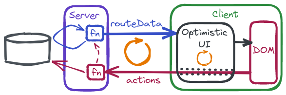

# SolidStart TodoMVC

A development-only port of [remix-todomvc](https://github.com/kentcdodds/remix-todomvc) ([license](https://github.com/kentcdodds/remix-todomvc/blob/main/LICENSE.md)) utilizing primitives and techniques supported directly by [SolidStart](https://start.solidjs.com/) and [SolidJS](https://www.solidjs.com/).

## Background

Despite the SolidStart repository already having its [own implementation](https://github.com/solidjs/solid-start/tree/main/examples/todomvc) of an optimistic UI [TodoMVC](https://todomvc.com/), in [Learning Angular w/ Minko Gechev](https://youtu.be/tfxxeknwsi8?t=12032) [remix-todomvc](https://github.com/kentcdodds/remix-todomvc) was presented as a sort of new gold standard.

Curiosity piqued, this sparked a journey of:
- [Scratch refactoring](https://xp123.com/articles/scratch-refactoring/) SolidStart's own TodoMVC [example](https://github.com/solidjs/solid-start/tree/main/examples/todomvc) to identify the primitives and techniques employed.
- Some familiarizaton with Remix via the [Jokes App Tutorial](https://remix.run/docs/en/v1/tutorials/jokes).
- Scratch refactoring [remix-todomvc](https://github.com/kentcdodds/remix-todomvc) to identify its approaches (leading to [remix-todomvc-kcd-v2](https://github.com/peerreynders/remix-todomvc-kcd-v2))

in preparation for implementing this (development-only) SolidStart variation.

---
```shell
$ cd solid-start-todomvc-kcd-v2
$ npm i

added 461 packages, and audited 462 packages in 3s

58 packages are looking for funding
  run `npm fund` for details

found 0 vulnerabilities
$ cp .env.example .env
$ npm run dev

> solid-start-todomvc-kcd-v2@0.0.0 dev
> solid-start dev

 solid-start dev 
 version  0.2.20
 adapter  node

  VITE v3.2.5  ready in 537 ms

  ➜  Local:   http://localhost:3000/
  ➜  Network: use --host to expose
  ➜  Inspect: http:/localhost:3000/__inspect/

  ➜  Page Routes:
     ┌─ http://localhost:3000/*todos
     ├─ http://localhost:3000/
     └─ http://localhost:3000/login

  ➜  API Routes:
     None! 👻

  > Server modules: 
   http://localhost:3000/_m/*
```

**Note**: The in-memory server side store re-seeds itself (johnsmith@outlook.com J0hn5M1th) whenever the `todos-persisted.json` file cannot be found.

---

> Everyone needs a framework; what everyone doesn't need is a general purpose framework. Nobody has a general problem, everyone has a very specific problem they're trying to solve. 

[Rasmus Lerdorf (2013)](https://youtu.be/anr7DQnMMs0?t=1917)

> Primitives not frameworks 

[Werner Vogels (2016)](https://www.allthingsdistributed.com/2016/03/10-lessons-from-10-years-of-aws.html#:~:text=Primitives%20not%20frameworks)

---

- [Optimistic UI](#optimistic-ui)
  - [Server Error Types](#server-error-types)
  - [NewTodo Support](#new-todo-support)
    - [`makeNewTodoSupport`](#make-new-todo-support)
    - [`makeNewTodoState`](#make-new-todo-state)
    - [NewTodo function (server side)](#new-todo-fn)
  - [Todo Support](#todo-support)
    - [`makeTodoSupport`](#make-todo-support)
    - [`makeTodoComposer`](#make-todo-composer)
    - [TodoAction function (server side)](#todo-action-fn)
  - [Todo Item Support](#todo-item-support)
    - [`makeTodoItemSupport`](#make-todo-item-support)


## Optimistic UI
<a name="optimistic-ui"></a>

The optimistic UI augments the known server based state with knowledge of pending server bound actions to create a "to be" represention for display to the user. 



The server based todos are composed with the pending new todos (from [NewTodo Support](#new-todo-support)) within [Todo Support](#todo-support) which also applies any pending todo actions. [TodoItem Support](#todo-item-support) counts, filters and sorts the todos for display.


These parts are composed in the `Todos` component function:

```TypeScript
// file: src/routes/[...todos].tsx

function Todos(props: {
  maybeFiltername: Accessor<MaybeFiltername>;
  email: string;
}) {
  const newTodos = makeNewTodoSupport();
  const { createTodo, showNewTodo, toBeTodos } = newTodos;

  const data = useRouteData<typeof routeData>();
  const { todoAction, composed } = makeTodoSupport(data, toBeTodos);

  const { counts, todoItems } = makeTodoItemSupport(
    props.maybeFiltername,
    composed
  );

  return (
    <>
      { /* … a boatload of JSX … */ } 
    </>
  );
}
```

- `data` is the resource signal exposed by [`useRouteData()`](https://start.solidjs.com/api/useRouteData) carrying the todos originating from the server via the `routeData` function.
- `toBeTodos` is a signal exposed by [NewTodo Support](#new-todo-support) which carries any todos who's creation is currently *pending*, i.e. a `newTodo` server action is `pending` but has not yet `completed` (or `failed`).
- `composed` (provided by [Todo Support](#todo-support)) is a signal that combines `data` and `toBeTodos`, transforming them according to any *pending* or *failed* todo actions.
- `counts` (provided by [TodoItem Support](#todo-item-support)) carries some todo counts while `todoItems` is the [store](https://www.solidjs.com/docs/latest#createstore) that yields a filtered and sorted `TodoView[]` to be rendered to the [DOM](https://developer.mozilla.org/en-US/docs/Web/API/Document_Object_Model). 

To minimize modifications to the DOM the optimistic `todos` are [reconciled](https://www.solidjs.com/docs/latest#reconcile) rather than just directly [*set*](#make-todo-item-support) with `setTodoItems`.

<a name="view-store-reconcile"></a>
To observe the effects of store reconciliation, inject the Todo DOM monitor ([todo-monitor.ts](src/todo-monitor.ts)):

```TypeScript
// ADD this …
import { scheduleCompare } from '~/todo-monitor';

/* … a lot more code … */

function makeTodoItemSupport(
  maybeFiltername: Accessor<MaybeFiltername>,
  todos: Accessor<TodoView[]>
) {
  const [todoItems, setTodoItems] = createStore<TodoView[]>([]);

  const counts = createMemo(() => {
    /* … more code … */

    filtered.sort(byCreatedAtDesc);
    setTodoItems(reconcile(filtered, { key: 'id', merge: false }));
    scheduleCompare(); // … and ADD this 

    return {
      total,
      active: total - complete,
      complete,
      visible,
    };
  });

  return {
    counts,
    todoItems,
  };
}
```

Assuming we are logged in as the pre-seeded user with the two item todo list, loading http://localhost:3000/todos will display something like the following in the developer console:
```
todo-monitor initialzed: 505.10 ms
```
Adding a single new todo will trigger the following activity:
```
Size: 2 ⮕  3
0 moved ⮕  1
1 moved ⮕  2
New items at: 0
Compared 5179.70 ms

0 has been ❌
New items at: 0
Compared 5253.80 ms
```

The optimistic UI inserts a new `li` at the top pushing the existing `li` elements down one position. 
Then the server based todo arrives and the optimistic `li` is replaced with a new `li` element with the server assigned todo ID (optimistic todos only have a temporary ID). 

Deleting the recent todo triggers the following:

```
Compared 8696.80 ms

Size: 3 ⮕  2
0 has been ❌
1 moved ⮕  0
2 moved ⮕  1
Compared 8755.50 ms
```

First the optimistic UI only hides the `li` element of the todo about to be deleted. Once the todo has been deleted on the server the corresponding `li` element is removed and the remaining `li` elements slide back up the list.

Lets compare that to an implemention without using `reconcile`:

```TypeScript
    filtered.sort(byCreatedAtDesc);
    // setTodoItems(reconcile(filtered, { key: 'id', merge: false }));
    setTodoItems(filtered);
    scheduleCompare();
```

Adding a new todo:

```
Size: 2 ⮕  3
0 has been ❌
1 has been ❌
New items at: 0, 1, 2
Compared 4184.30 ms

0 has been ❌
1 has been ❌
2 has been ❌
New items at: 0, 1, 2
Compared 4258.60 ms
```

Even the `li` elements of the todos that haven't changed are replaced. Deleting the recently added todo:

```
0 has been ❌
1 has been ❌
2 has been ❌
New items at: 0, 1, 2
Compared 5750.10 ms

Size: 3 ⮕  2
0 has been ❌
1 has been ❌
2 has been ❌
New items at: 0, 1
Compared 5802.10 ms
```

The optimistic UI only hides the "to be deleted todo" however **all** the `li` elements in the todo list are replaced.Once the todo has been deleted on the server all the `li` elements are deleted once again while new ones are inserted to represent the todos that haven't changed.  

Simply using a signal/memo of a `TodoView[]` value would yield a similar result.

To minimize DOM manipulations it is critical to use a view [store](https://www.solidjs.com/docs/latest/api#using-stores) for list style data and use [reconcile](https://www.solidjs.com/docs/latest/api#reconcile) to synchronize it with the source information.

### Server Error Types

In order to freely access any reactive sources during setup `Todos` was factored out of the `TodosPage`:

```TypeScript
export default function TodosPage() {
  const location = useLocation();
  const filtername = createMemo(() => pathToFiltername(location.pathname));
  const user = useUser();

  return (
    <ErrorBoundary
      fallback={(error) => {
        if (error instanceof FormError) {
          return <div>Unhandled (action) FormError: {error.message}</div>;
        }

        if (error instanceof ServerError) {
          if (error.status === 400) {
            return <div>You did something wrong: {error.message}</div>;
          }

          if (error.status === 404) {
            return <div>Not found</div>;
          }

          return (
            <div>
              Unexpected server error with status: {error.status} (
              {error.message})
            </div>
          );
        }

        if (error instanceof Error) {
          return <div>An unexpected error occurred: {error.message}</div>;
        }

        return <div>An unexpected caught value: {error.toString()}</div>;
      }}
    >
      <Show when={filtername()} fallback={<Navigate href={todosHref} />}>
        <Show
          when={user()}
          fallback={<Navigate href={loginHref(location.pathname)} />}
        >
          <Todos maybeFiltername={filtername} email={user()?.email ?? ''} />
        </Show>
      </Show>
    </ErrorBoundary>
  );
}
```

This way there is no danger of [suspense leaks](https://github.com/peerreynders/solid-start-notes-basic#suspense-leaks) from `TodosPage` to the container component. 
The [`ErrorBoundary`](https://www.solidjs.com/docs/latest/api#errorboundary) in `TodosPage` will catch any error that is thrown in `Todos`—regardless whether it happens in the setup portion or (inside the effect boundary of) the JSX of `Todos`.

Broadly errors can be categorized in the following manner:
<a name="error-types"></a>
- [instanceof](https://developer.mozilla.org/en-US/docs/Web/JavaScript/Reference/Operators/instanceof) `FormError`s  are used for server side form validation errors which result in a [`400 Bad Request`](https://developer.mozilla.org/en-US/docs/Web/HTTP/Status/400) response status.
- `instanceof` `ServerError`s are used for errors requiring other [client error response codes](https://developer.mozilla.org/en-US/docs/Web/HTTP/Status#client_error_responses).
- All other [`Error`](https://developer.mozilla.org/en-US/docs/Web/JavaScript/Reference/Global_Objects/Error)s will result in a [server error response code](https://developer.mozilla.org/en-US/docs/Web/HTTP/Status#server_error_responses).
- For more customized error responses a [`Response`](https://developer.mozilla.org/en-US/docs/Web/API/Response) can be thrown. 
For more details see [`respondWith`](https://github.com/solidjs/solid-start/blob/main/packages/start/server/server-functions/server.ts).
- Server side errors resulting from an action will always attach to the corresponding `Submission` and will not propagate further into the client side application; they have to be explicitly re-thrown to propagate to the nearest `ErrroBoundary`.

Note also that `TodosPage` uses [`Navigate`](https://start.solidjs.com/api/Navigate) to correct an incorrect URL or to redirect to the login when it detects that no user session is available.

### NewTodo Support
<a name="new-todo-support"></a>
NewTodo support is responsible for tracking *pending* and *failed* `newTodo` server actions while exposing any optimistic new todos to [Todo Support](#todo-support). It handles multiple `NewTodo`s composed of the following information:

```TypeScript
const makeNewTodo = (id: string) => ({
  id,
  title: '',
  message: undefined as string | undefined,
});

type NewTodo = ReturnType<typeof makeNewTodo>;
```
The `id` is temporary (assigned client side) and replaced server side with a permanent one when the `todo` is persisted. `title` is the proposed title pending server side approval. `message` holds the error message when a `NewTodo` fails server side validation. `NewTodos` submitted but not yet persisted (`pending`, not `completed`) are also represented as a `TodoView`:

```TypeScript
const view = {
  id: info.id,
  title,
  complete: false,
  createdAt,
  toBe: TO_BE.created,
  message: undefined,
};
```

These `pending` `TodoView`s are exposed via the `toBeTodos()` signal to be mixed-in with the server provided todos in [Todo Support](#todo-support). 

The `newTodo` action phases are captured in the `ActionPhase` [union type](https://www.typescriptlang.org/docs/handbook/2/everyday-types.html#union-types):

```TypeScript
type ActionPhase = 'pending' | 'completed' | 'failed';
```

Only one single `NewTodo` is displayed at a time. Typically that is the next todo to be created. However the optimistic UI makes it possible to quickly create many todos in succession before any of them have been accepted by the server, so it is conceivable to have multiple `NewTodo`s in the `failed` state. In that case one failed todo is shown at a time before another entirely new todo can be created. The `NewTodo` to be shown on the UI is exposed via the `showNewTodo()` signal: 

```JSX
// file: src/routes/[...todos].tsx

<createTodo.Form class="c-new-todo" onsubmit={newTodos.onSubmit}>
  <input type="hidden" name="kind" value="newTodo" />
  <input type="hidden" name="id" value={showNewTodo().id} />
  <input
    ref={newTodos.ref.createdAt}
    type="hidden"
    name="created-at"
  />
  <input
    ref={newTodos.ref.title}
    class="c-new-todo__title"
    placeholder="What needs to be done?"
    name="title"
    value={showNewTodo().title}
    autofocus
    aria-invalid={newTodoInvalid(newTodos)}
    aria-errormessage={newTodoErrorId(newTodos)}
  />
  <Show when={newTodoHasError(newTodos)}>
    <div
      id={newTodoErrorId(newTodos)}
      class="c-new-todo__error c-todos--error"
    >
      {newTodoErrorMessage(newTodos)}
    </div>
  </Show>
</createTodo.Form>
```

The [Show](https://www.solidjs.com/docs/latest/api#show) fragment only appears for a `failed` `NewTodo`. 

Auxiliary functions for the JSX:
```TypeScript
const newTodoInvalid = ({ showNewTodo }: NewTodoSupport) =>
  showNewTodo().message ? true : undefined;

const newTodoHasError = ({ showNewTodo }: NewTodoSupport) =>
  typeof showNewTodo().message !== 'undefined';

const newTodoErrorId = ({ showNewTodo }: NewTodoSupport) =>
  showNewTodo().message ? `new-todo-error-${showNewTodo().id}` : undefined;

const newTodoErrorMessage = ({
  showNewTodo,
}: NewTodoSupport): string | undefined => showNewTodo().message;

```

#### `makeNewTodoSupport`
<a name="make-new-todo-support"></a>
`makeNewTodoSupport` uses a [`createServerMultiAction$()`](https://start.solidjs.com/api/createServerMultiAction). 
This makes it possible to support multiple concurrent `NewTodo` submissions.
With [`createServerAction$()`](https://start.solidjs.com/api/createServerAction) only the latest submission is processed while any `pending` submissions are discarded.

```TypeScript
function makeNewTodoSupport() {
  const [creatingTodo, createTodo] = createServerMultiAction$(newTodoFn);

  const state = makeNewTodoState();

  const ref = {
    createdAt: undefined as HTMLInputElement | undefined,
    title: undefined as HTMLInputElement | undefined,
  };
  const syncTitle = (info: NewTodo) => {
    if (!ref.title) return;

    info.title = ref.title.value;
  };

  const current = createMemo(
    (prev: NewTodosCurrent) => {
      for (const submission of creatingTodo) {
        // Note: order matters
        if (typeof submission.result !== 'undefined') {
          state.applyUpdate('completed', submission.input);
          submission.clear();
          continue;
        } else if (typeof submission.error !== 'undefined') {
          const handled = state.applyUpdate(
            'failed',
            submission.input,
            submission.error
          );
          submission.clear();
          if (!handled) throw submission.error;
          continue;
        } else if (typeof submission.input !== 'undefined') {
          state.applyUpdate('pending', submission.input);
          continue;
        }
      }

      // Is the showNewTodo about to be swapped out?
      const next = state.current();
      if (next.showNewTodo !== prev.showNewTodo) syncTitle(prev.showNewTodo);

      return next;
    },
    state.current(),
    { equals: newTodosCurrentEquals }
  );

  // Split `current` for independent `showNewTodo`
  // and `toBeTodos` change propagation
  const showNewTodo = createMemo(() => current().showNewTodo, {
    equals: showNewTodoEquals,
  });

  const toBeTodos = createMemo(() => current().toBeTodos, {
    equals: toBeTodosEquals,
  });

  return {
    createTodo,
    showNewTodo,
    toBeTodos,
    ref,
    onSubmit(_e: unknown) {
      const createdAt = ref.createdAt;

      if (!(createdAt instanceof HTMLInputElement))
        throw new Error('Cannot find created-at input');

      // This value is only used
      // for the optimistic todo (for sorting).
      //
      // The server will assign the
      // final `id` and `createdAt` when
      // the todo is persisted.
      createdAt.value = Date.now().toString();
    },
  };
}

type NewTodoSupport = ReturnType<typeof makeNewTodoSupport>;

```

[`NewTodoState`](#make-new-todo-state) manages the one single "new" `NewTodo` and those that are either `pending` (with their `TodoView`) or have `failed`. `completed` `NewTodo`s are discarded as those now have a `TodoView` coming from the server. 

The `createdAt` [`ref`](https://www.solidjs.com/docs/latest/api#ref) is used during `createTodo` form submission to set the hidden `created-at` `HTMLInputElement` to a preliminary value needed for the appropriate sorting of the resulting optimistic `TodoView` in the todo list.

The `title` `ref` is used to synchronize the title from the `title` `HTMLInputElement` into the current `NewTodo` just before the information from another `NewTodo` is swapped into the `createTodo` form. 

The `current` [memo](https://www.solidjs.com/docs/latest/api#creatememo) aggregates the `creatingTodo` submissions to `toBeTodos` `TodoView[]` based on all the `pending` submissions and `showNewTodo` as the `NewTodo` to be placed in the `createTodo` form. 
The submission aggregation is handled by [`NewTodoState`](#make-new-todo-state) while `NewTodoSupport` directs the mapping of submission state:

- A submission `result` indicates that the submission has `completed`. Note that the submission is `clear`ed once it has been processed by `NewTodoState` resetting it to [idle](https://start.solidjs.com/actions-machine.png).
- A submission `error` indicates that the submission has `failed`. Note that the submission is `clear`ed once it has been processed by `NewTodoState` resetting it to [idle](https://start.solidjs.com/actions-machine.png). 
When `failed` isn't handled (i.e. the return value isn't `true`) the submission `error` is re-thrown.
- Otherwise if there is a submission `input` (while `result` and `error` are absent) the submission is `pending` (not cleared as the submission has yet to reach `completed` or `failed`).

Both `toBeTodos` and `showNewTodo` are separated into their own memos to decouple their dependencies from the change propagation of the `current()` aggregated value.

#### `makeNewTodoState`
<a name="make-new-todo-state"></a>

`NewTodoState` tracks `pending` and `failed` `creatingTodo` submissions in order to expose the `toBeTodos` for the todo list and select the `showNewTodo` to be placed in the `createTodo` form.

`map` contains all `pending` and `failed` `NewTodo`s and one single "new" `NewTodo`:
- By convention the last one added to `map` (i.e. last in terms of insertion order) is the "new", "fresh" `NewTodo` (`lastNew`).
- `failed` `NewTodo`s have a `message`. They are tracked with `failedSet`.
- Any remaining `NewTodo`s are `pending`. These are tracked in `pendingMap` which cross references the `TodoView` counterpart in `toBeTodos`. 

`addNewTodo` adds a "fresh" `NewTodo` to `map` while also keeping track of it with `lastNew`.
`removeNewTodo` deletes a `NewTodo` entirely from `map` which only happens when the associated submission has `completed`.

`addFailedTodo` sets the `NewTodo` `message` and adds it to the `failedSet`. 
`firstFailed` tracks the oldest of the `NewTodo` errors; it will be used as the `showNewTodo`.
`removeFailedTodo` removes the `NewTodo` from `failedSet` and clears the `message`.
If necessary, `firstFailed` is set to the next `failed` `NewTodo` (utilizing the [`next()` iterator method](https://developer.mozilla.org/en-US/docs/Web/JavaScript/Reference/Iteration_protocols#the_iterator_protocol) which will return the oldest `NewTodo` in terms of insertion order).

`addPendingTodo` creates an equivalent `TodoView` which is cross referenced with `pendingMap` and placed in `toBeTodos` ([`concat()`](https://developer.mozilla.org/en-US/docs/Web/JavaScript/Reference/Global_Objects/Array/concat) is used to make it easy to detect a change of `toBeTodos`).
`removePendingTodo` removes the `NewTodo` from both `pendingMap` and `toBeTodos` (again [`filter()`](https://developer.mozilla.org/en-US/docs/Web/JavaScript/Reference/Global_Objects/Array/filter) makes it easier to detect that `toBeTodos` has changed).

These functions are used to implement the `ActionPhaseFn` functions on the `update` [`Record`](https://www.typescriptlang.org/docs/handbook/utility-types.html#recordkeys-type).

```TypeScript
type ActionPhaseFn = (form: FormData, error?: Error) => true | undefined;

function makeNewTodoState() {
  // Keep track of active `NewTodo`s
  let lastNew = makeNewTodo(nextId());
  const map = new Map<string, NewTodo>([[lastNew.id, lastNew]]);

  const addNewTodo = () => {
    const newId = nextId();
    const newTodo = makeNewTodo(newId);
    map.set(newId, newTodo);
    lastNew = newTodo;
  };

  const removeNewTodo = (info: NewTodo) => map.delete(info.id);

  // Keep track of any failed `NewTodo` submissions
  let firstFailed: NewTodo | undefined = undefined;
  const failedSet = new Set<NewTodo>();

  const addFailedTodo = (info: NewTodo, message: string) => {
    info.message = message;
    failedSet.add(info);
    if (!firstFailed) firstFailed = info;
  };

  const removeFailedTodo = (info: NewTodo) => {
    if (!failedSet.delete(info)) return;
    info.message = undefined;

    if (info !== firstFailed) return;

    const value = failedSet.values().next().value;
    firstFailed = value && 'id' in value ? (value as NewTodo) : undefined;
  };

  // Keep track of in progress `NewTodo` actions
  // and base optimistic `toBe` `TodoView`s on them
  const pendingMap = new WeakMap<NewTodo, TodoView>();
  let toBeTodos: TodoView[] = [];

  const addPendingTodo = (info: NewTodo, title: string, createdAt: number) => {
    const view = {
      id: info.id,
      title,
      complete: false,
      createdAt,
      toBe: TO_BE.created,
      message: undefined,
    };

    pendingMap.set(info, view);
    toBeTodos = toBeTodos.concat(view);
  };

  const removePendingTodo = (info: NewTodo) => {
    const view = pendingMap.get(info);
    if (!view) return;

    toBeTodos = toBeTodos.filter((v) => v !== view);
    pendingMap.delete(info);
  };

  const update: Record<ActionPhase, ActionPhaseFn> = {
    pending(form: FormData) {
      const id = form.get('id');
      if (typeof id !== 'string') return;

      const info = map.get(id);
      if (!info || pendingMap.has(info)) return;

      removeFailedTodo(info);
      if (info === lastNew) addNewTodo();

      const title = form.get('title');
      const createdAt = Number(form.get('created-at'));
      if (typeof title !== 'string' || Number.isNaN(createdAt)) return;

      addPendingTodo(info, title, createdAt);
      return true;
    },

    completed(form: FormData) {
      const id = form.get('id');
      if (typeof id !== 'string') return;

      const info = map.get(id);
      if (!info) return;

      removePendingTodo(info);
      removeFailedTodo(info);
      removeNewTodo(info);
      return true;
    },

    failed(form: FormData, error?: Error) {
      const id = form.get('id');
      if (!(error instanceof FormError) || typeof id !== 'string') return;

      const info = map.get(id);
      if (!info) return;

      if (failedSet.has(info)) {
        info.message = error?.message || 'Todo title error';
        return true;
      }

      removePendingTodo(info);
      addFailedTodo(info, error?.message || 'Todo title error');
      return true;
    },
  };

  return {
    applyUpdate(phase: ActionPhase, form: FormData, error?: Error) {
      return update[phase](form, error);
    },

    current() {
      return {
        showNewTodo: firstFailed ? firstFailed : lastNew,
        toBeTodos,
      };
    },
  };
}

type NewTodosCurrent = ReturnType<
  ReturnType<typeof makeNewTodoState>['current']
>;
```

- For a `pending` submission, `id`, `title`, and `createdAt` are obtained from the form data.
  - The corresponding `NewTodo` is looked up.
  - If the `NewTodo` isn't already `pending` it's removed from `failedSet`
  - If the `NewTodo` was the "fresh" (`lastNew`) `NewTodo`, a new, "fresh" `NewTodo` is added.
  - Finally the `NewTodo` is recorded as `pending`.
- For a `completed` submission the `id` is obtained from the form data and the corresponding `NewTodo` is purged from all `NewTodoState`.
- `failed` submissions are only handled when they are a [`FormError`](#error-types).
  - If the `NewTodo` is already `failed` its `message` is updated.
  - Otherwise the `NewTodo` is purged from `pending` and added to `failed`.

`NewTodoState` only exposes two functions (to [NewTodo Support](#new-todo-support)): `applyUpdate` to apply a submission's state to `NewTodoState` and `current` which returns the current `showNewTodo` and `toBeTodos` value.

#### NewTodo function (server side)
<a name="new-todo-fn"></a>

The submissions from the `createTodo` form of [`NewTodoSupport`](#make-new-todo-support) are processed by the `newTodoFn` server side function. 
The `requireUser()` function ensures that a user session is embedded in the request before obtaining the todo (temporary) `id` and the `title` for the form data. For demonstration purposes:
- The format of the temporary `id` is validated.
- The `title` is guarded against containing "error" (thereby demonstrating the `NewTodo` `failed` state).

The actual title validation only ensures the presence of a title. 

After successful validation the todo is inserted into the user's todo list.

```TypeScript
/* file: src/routes/[...todos].tsx (SERVER SIDE) */

async function newTodoFn(form: FormData, event: ServerFunctionEvent) {
  const user = requireUser(event);
  const id = form.get('id');
  const title = form.get('title');

  if (typeof id !== 'string' || typeof title !== 'string')
    throw new ServerError('Invalid form data');

  const newIdError = validateNewId(id);
  if (newIdError) throw new ServerError(newIdError);

  const demoError = demoTitleError(title);
  if (demoError)
    throw new FormError(demoError, {
      fieldErrors: {
        title: demoError,
      },
      fields: {
        kind: 'newTodo',
        id,
        title,
      },
    });

  const titleError = validateTitle(title);
  if (titleError)
    throw new FormError(titleError, {
      fieldErrors: {
        title: titleError,
      },
      fields: {
        kind: 'newTodo',
        id,
        title,
      },
    });

  const count = await insertTodo(user.id, title);
  if (count < 0) throw new ServerError('Invalid user ID', { status: 401 });

  return json({ kind: 'newTodo', id });
}
```

### Todo Support
<a name="todo-support"></a>
Todo support is responsible for tracking *pending* and *failed* server actions that apply to individual existing todos or the todo list as a whole.
This allows it to compose the `toBeTodos` (from [NewTodo Support](#new-todo-support)) and the server todos, transforming them to their optimistic state. 

Todo Support doesn't have any direct visual representation on the UI other than the `todoAction` form that is used within `TodoItem` but acts as a preparatory stage for [TodoItem Support](#todo-item-support) while also handling all of `TodoItem`'s interactivity. 

#### `makeTodoSupport`
<a name="make-todo-support"></a>

One single [createServerMultiAction$()](https://start.solidjs.com/api/createServerMultiAction) is used for all the actions that pertain to the todo list as a whole (`clearTodos`, `toggleAllTodos`) or individual todos (`deleteTodo`, `toggleTodo`, `updateTodo`). 
This has the advantage that all action `Submission`s exist in the same array, presumably preserving their relative submission order (which is valuable when submission order affects the optimistic result).

The [`FormData`](https://developer.mozilla.org/en-US/docs/Web/API/FormData) to the server is interpreted in the manner of a [discriminated union](https://www.typescriptlang.org/docs/handbook/2/narrowing.html#discriminated-unions) with the `kind` field acting as the discriminating key.

The [`TodoComposer`](#make-todo-composer) is responsible for applying predicted outcomes of the current `Submission`s to the `TodoView []`
(the `toBeTodos` are included as they can be affected by subsequent `toggleAllTodos` actions).

The `composed` memo combines the `serverTodos` resource and `toBeTodos` from [NewTodo support](#new-todo-support) to load the `TodoComposer`.
It then maps each `Submission` state to `completed`, `failed`, or `pending` (`ActionPhase`) before applying it via `TodoComposer`. 
Before extracting the resulting `TodoView[]` data it directs the `TodoComposer` to apply the relevant errors. 

```TypeScript
function makeTodoSupport(
  serverTodos: Resource<TodoView[] | undefined>,
  toBeTodos: Accessor<TodoView[]>
) {
  const [takingAction, todoAction] = createServerMultiAction$(todoActionFn);
  const composer = makeTodoComposer();

  const composed = createMemo(() => {
    const todos = serverTodos();
    composer.loadTodos(todos ? toBeTodos().concat(todos) : toBeTodos());

    for (const submission of takingAction) {
      // Note: order matters
      if (typeof submission.result !== 'undefined') {
        composer.apply('completed', submission.input);
        submission.clear();
        continue;
      } else if (typeof submission.error !== 'undefined') {
        const handled = composer.apply(
          'failed',
          submission.input,
          submission.error
        );
        submission.clear();
        if (!handled) throw submission.error;
        continue;
      } else if (typeof submission.input !== 'undefined') {
        composer.apply('pending', submission.input);
        continue;
      }
    }

    composer.applyErrors();
    return composer.result;
  });

  return {
    todoAction,
    composed,
  };
}
```
`makeTodoSupport` returns `todoAction` to expose the form for the `TodoItem` JSX and the `composed` memo to feed into [TodoItem Support](#todo-item-support).

#### `makeTodoComposer`
<a name="make-todo-composer"></a>

A `TodoComposer` usage cycle consists of:
- `loadTodos()` to set the `TodoView[]` to be manipulated. 
- An `apply()` for each `Submission` on the action where the `pending`, `completed` or `failed` state is applied to the `TodoView[]`.
- `applyErrors()` to transfer the accumulated errors to the `TodoView[]`
- Finally the `result` getter property is used to obtain the optimistic `TodoView[]`.

`updateErrors` is used to hold `updateTodo` errors across usage cycles (as the `Submission` is cleared once `failed` is applied). 
These errors are only dropped when the same todo `id` cycles through the next `updateTodo` `pending` submission.

`index` maps directly into the `TodoView[]` being manipulated.

`compose` holds `Record<ActionPhase, ActionPhaseFn>` objects categorized by the `TodoActionKind` `kind`: `clearTodos`, `deleteTodo`, `toggleAllTodos`, `toggleTodo`, and `updateTodo`. 
Each of these objects hold an `ActionPhaseFn` for a relevant `Submission` state (`pending`, `completed`, `failed`). Any `ActionPhase` without a relevant `ActionPhaseFn` is simply omitted: 
- `clearTodos` (`pending`) marks completed todos in `TodoView[]` as `TO_BE.deleted`.
- `deleteTodo` (`pending`) marks the identified todo as `TO_BE.deleted` while ignoring specific `failed` states (i.e. todo no longer exists).
- `toggleAllTodos` (`pending`) changes all todos (not to be deleted) to the indicated active/complete state.
- `toggleTodo` (`pending`) changes the identified todo to the indicated active/complete state.
- `updateTodo` covers all three `ActionPhase`s:
  - `pending` removes the todo from `updateErrors`, updates the `title` and marks it as `TO_BE.updated`. 
  - `completed` removes the todo from `updateErrors` (though `pending` should have already taken care of that).
  - `failed` places the todo and error on `updateErrors` (provided the error is a form validation error) for later application via `applyErrors()` 

```TypeScript
function makeTodoComposer() {
  const updateErrors = new Map<string, { title: string; message: string }>();
  const index = new Map<string, TodoView>();

  const compose: Record<TodoActionKind, Partial<Record<ActionPhase, ActionPhaseFn>>> = {
    clearTodos: {
      pending(_form: FormData) {
        for (const todo of index.values()) {
          if (!todo.complete || todo.toBe !== TO_BE.unchanged) continue;

          todo.toBe = TO_BE.deleted;
        }
        return true;
      },
    },

    deleteTodo: {
      pending(form: FormData) {
        const id = form.get('id');
        if (typeof id !== 'string') return;

        const todo = index.get(id);
        if (todo) todo.toBe = TO_BE.deleted;

        return true;
      },
      failed(_form: FormData, error?: Error) {
        // Don't care if toBe deleted todo doesn't exist anymore
        if (error instanceof ServerError && error.status === 404) return true;

        // Error not handled
        return undefined;
      },
    },

    toggleAllTodos: {
      pending(form: FormData) {
        const complete = toCompleteValue(form);
        if (typeof complete !== 'boolean') return;

        for (const todo of index.values()) {
          if (todo.complete === complete || todo.toBe == TO_BE.deleted)
            continue;

          todo.complete = complete;
        }
        return true;
      },
    },

    toggleTodo: {
      pending(form: FormData) {
        const id = form.get('id');
        const complete = toCompleteValue(form);
        if (typeof id !== 'string' || typeof complete !== 'boolean') return;

        const todo = index.get(id);
        if (todo) todo.complete = complete;
        return true;
      },
    },

    updateTodo: {
      pending(form: FormData) {
        const id = form.get('id');
        const title = form.get('title');
        if (typeof id !== 'string' || typeof title !== 'string') return;

        updateErrors.delete(id);
        const todo = index.get(id);
        if (!todo) return;

        todo.title = title;
        todo.toBe = TO_BE.updated;
        return true;
      },

      completed(form: FormData) {
        const id = form.get('id');
        if (typeof id !== 'string') return;

        updateErrors.delete(id);
        return true;
      },

      failed(form: FormData, error?: Error) {
        const id = form.get('id');
        const title = form.get('title');
        if (
          !(error instanceof FormError) ||
          typeof id !== 'string' ||
          typeof title !== 'string'
        )
          return;

        const todo = index.get(id);
        if (!todo) return;

        // Messages are applied to TodoViews
        // during `applyErrors`
        updateErrors.set(id, {
          title,
          message: error?.message || 'Todo title error',
        });
        return true;
      },
    },
  };

  return {
    loadTodos(nextTodos: TodoView[]) {
      index.clear();
      for (const todo of nextTodos) index.set(todo.id, cloneTodoView(todo));
    },

    get result() {
      return Array.from(index.values());
    },

    apply(phase: ActionPhase, form: FormData, error?: Error) {
      const kind = form.get('kind');
      if (!kind || typeof kind !== 'string') return;

      const fn = (compose[kind as TodoActionKind])?.[phase];
      if (typeof fn !== 'function') return;

      return fn(form, error);
    },

    applyErrors() {
      for (const [id, data] of updateErrors) {
        const todo = index.get(id);
        if (todo) {
          todo.title = data.title;
          todo.message = data.message;
          continue;
        }

        updateErrors.delete(id);
      }
    },
  };
}
```

#### TodoAction function (server side)
<a name="todo-action-fn"></a>

All todo actions go through the server side `todoActionFn` function.
It uses the `kind` [FormData](https://developer.mozilla.org/en-US/docs/Web/API/FormData) field as a  `TodoActionKind` discriminator to select the appropriate `TodoActionFn` from the `todoActions` lookup object.

After ensuring that a corresponding user session exists it delegates action processing to the selected `TodoActionFn`.

```TypeScript
/* file: src/routes/[...todos].tsx (SERVER SIDE) */

type TodoActionKind =
  | 'clearTodos'
  | 'deleteTodo'
  | 'toggleAllTodos'
  | 'toggleTodo'
  | 'updateTodo';

type TodoActionResult = {
  kind: TodoActionKind;
  id: string;
};

type TodoActionFn = (
  user: User,
  form: FormData
) => Promise<ReturnType<typeof json<TodoActionResult>>>;

/* … todoActions definition … */

async function todoActionFn(
  form: FormData,
  event: ServerFunctionEvent
): Promise<ReturnType<typeof json<TodoActionResult>>> {
  // await delay(2000);
  const kind = form.get('kind');
  if (typeof kind !== 'string') throw new Error('Invalid Form Data');

  const actionFn = todoActions[kind as TodoActionKind];
  if (!actionFn) throw Error(`Unsupported action kind: ${kind}`);

  const user = requireUser(event);
  return actionFn(user, form);
}

```

`todoActions` holds one server side `TodoActionFn` for each `TodoActionKind`: `clearTodos`, `deleteTodo`, `toggleAllTodo`, `toggleTodo`, and `updateTodo`.

- `clearTodos` removes all the user's complete todos.
- `deleteTodo` deletes the identified todo from the user's todo list.
- `toggleAllTodos` sets all the user's todos to the indicated active/complete state.
- `toggleTodo` sets the identified todo to the indicated active/complete state.
- `updateTodo` modifies the identified todo's title. The title can fail validation which results in a `FormError` which delivers the error back to the UI via the corresponding action `Submission`.

```TypeScript
const todoActions: Record<TodoActionKind, TodoActionFn> = {
  async clearTodos(user: User, _form: FormData) {
    const count = await deleteTodosCompleteByUserId(user.id);
    if (count < 0)
      throw new ServerError('Todo list not found', { status: 404 });

    return json({ kind: 'clearTodos', id: 'clearTodos' });
  },

  async deleteTodo(user: User, form: FormData) {
    const id = form.get('id');
    if (typeof id !== 'string') throw new ServerError('Invalid Form Data');

    const count = await deleteTodoById(user.id, id);
    if (count < 0) throw new ServerError('Todo not found', { status: 404 });

    return json({ kind: 'deleteTodo', id });
  },

  async toggleAllTodos(user: User, form: FormData) {
    const complete = toCompleteValue(form);

    if (typeof complete !== 'boolean') throw new Error('Invalid Form Data');

    const count = await updateAllTodosCompleteByUserId(user.id, complete);
    if (count < 0)
      throw new ServerError('Todo list not found', { status: 404 });

    return json({ kind: 'toggleAllTodos', id: 'toggleAllTodos' });
  },

  async toggleTodo(user: User, form: FormData) {
    const id = form.get('id');
    const complete = toCompleteValue(form);

    if (typeof id !== 'string' || typeof complete !== 'boolean')
      throw new Error('Invalid Form Data');

    const count = await updateTodoCompleteById(user.id, id, complete);
    if (count < 0) throw new ServerError('Todo not found', { status: 404 });

    return json({ kind: 'toggleTodo', id });
  },

  async updateTodo(user: User, form: FormData) {
    const id = form.get('id');
    const title = form.get('title');

    if (typeof id !== 'string' || typeof title !== 'string')
      throw new ServerError('Invalid form data');

    const demoError = demoTitleError(title);
    if (demoError)
      throw new FormError(demoError, {
        fieldErrors: {
          title: demoError,
        },
        fields: {
          kind: 'updateTodo',
          id,
          title,
        },
      });

    const titleError = validateTitle(title);
    if (titleError)
      throw new FormError(titleError, {
        fieldErrors: {
          title: titleError,
        },
        fields: {
          kind: 'updateTodo',
          id,
          title,
        },
      });

    const count = await updateTodoTitleById(user.id, id, title);
    if (count < 0) throw new ServerError('Todo not found', { status: 404 });

    return json({ kind: 'updateTodo', id });
  },
}
```

### Todo Item Support
Todo Item Support takes the optimistic todos supplied by [Todo Support](#todo-support) and the currently active filtername to derive essential counts before it filters and sorts the todos for display.

The counts collected are:
- `total` number of unfiltered todos (excluding `TO_BE.deleted`)
- `complete` unfiltered todos (excluding `TO_BE.deleted`)
- `active` unfiltered todos (excluding `TO_BE.deleted`)
- `visible` number of filtered todos (consequently excluding `TO_BE.deleted`)

```TypeScript
type TodoItemCounts = () => {
  total: number;
  active: number;
  complete: number;
  visible: number;
};
```

The filter is determined by the final path segment which follows the `todos` segment in the URL. It's either `active`, `complete`, or `all` (which is the default in the absence of the other alternatives). `TODOS_FILTER` provides a filtering predicate identifying the todos to be kept.

```TypeScript
const TODOS_FILTER = {
  all: undefined,
  active: (todo: TodoView) => !todo.complete,
  complete: (todo: TodoView) => todo.complete,
} as const;

type Filtername = keyof typeof TODOS_FILTER;
type MaybeFiltername = Filtername | undefined;

const isFiltername = (name: string): name is Filtername =>
  Object.hasOwn(TODOS_FILTER, name);

function pathToFiltername(pathname: string) {
  const name = todosFilter(pathname);
  return name && isFiltername(name) ? name : undefined;
}
```

The filtered todos are sorted in descending order of creation.

```TypeScript
function byCreatedAtDesc(a: TodoView, b: TodoView) {
  // newer first
  // cmp > 0  `a` after `b`
  // cmp < 0  `a` before `b`

  const aIsNew = a.toBe === TO_BE.created;
  const bIsNew = b.toBe === TO_BE.created;
  if (aIsNew === bIsNew) return b.createdAt - a.createdAt;

  // Always show optimistic
  // created todos before others
  return aIsNew ? -1 : 1;
}
```
#### `makeTodoItemSupport`
<a name="make-todo-item-support"></a>

`makeTodoItemSupport` creates a view [store](https://www.solidjs.com/docs/latest#using-stores) on which the DOM representation will be based and the `counts` memo which updates whenever the optimistic `TodoView[]` from [Todo Support](#todo-support) or the (URL-driven) filtername changes. 
Iterating on the up-to-date optimistic `TodoView[]` the counts and filtered `TodoView[]` are generated.

The `filtered` `TodoView[]` is sorted and then [`reconcile`](https://www.solidjs.com/docs/latest#reconcile)d into the `todoItems` store to [minimize the DOM updates](#view-store-reconcile).

`todoItems` is returned to render the `TodoItems` while `counts` is used in the neighbouring JSX.

```TypeScript
function makeTodoItemSupport(
  maybeFiltername: Accessor<MaybeFiltername>,
  todos: Accessor<TodoView[]>
) {
  const [todoItems, setTodoItems] = createStore<TodoView[]>([]);

  const counts = createMemo(() => {
    let total = 0;
    let complete = 0;
    let visible = 0;
    const filtered: TodoView[] = [];
    const keepFn = TODOS_FILTER[maybeFiltername() ?? 'all'];
    for (const todo of todos()) {
      if (!keepFn || keepFn(todo)) {
        filtered.push(todo);

        // Will be hidden but want to preserve
        // existing DOM elements in case of error
        if (todo.toBe === TO_BE.deleted) continue;

        // i.e. will be visible
        visible += 1;
      }

      // unfiltered counts
      total += 1;
      complete = todo.complete ? complete + 1 : complete;
    }

    filtered.sort(byCreatedAtDesc);
    setTodoItems(reconcile(filtered, { key: 'id', merge: false }));

    return {
      total,
      active: total - complete,
      complete,
      visible,
    };
  });

  return {
    counts,
    todoItems,
  };
}
```

Auxiliary functions for the `TodoItem` JSX
<details>
  <summary>…and the containing list:</summary>
  Aside: <a href="https://html.spec.whatwg.org/multipage/grouping-content.html#the-li-element">The <code>li</code> element</a> of the <em>HTML Living Standard</em> indicates that <code>&lt;li&gt;</code> has to have an <code>&lt;ol&gt;</code>, <code>&lt;ul&gt;</code>, or <code>&lt;menu&gt;</code> element as parent. 
  This strong coupling of the <em>list item</em> to the containing <em>list</em> suggests that the item is a cohesive part of the list rather than some relatively independent component. 
</details>

```TypeScript
const todoItemActionsDisabled = ({ toBe }: TodoView) =>
  toBe === TO_BE.created || toBe === TO_BE.deleted ? true : undefined;

const todoItemHidden = ({ toBe }: TodoView) =>
  toBe === TO_BE.deleted ? true : undefined;

const todoItemModifier = ({ complete }: TodoView) =>
  complete ? 'js-c-todo-item--complete ' : 'js-c-todo-item--active ';

const todoItemToggleModifier = ({ complete }: TodoView) =>
  complete
    ? 'js-c-todo-item__toggle--complete '
    : 'js-c-todo-item__toggle--active ';

const todoItemToggleTitle = ({ complete }: TodoView) =>
  complete ? 'Mark as active' : 'Mark as complete';

const todoItemToggleTo = ({ complete }: TodoView): string =>
  complete ? 'false' : 'true';

const todoItemInvalid = ({ message }: TodoView) => (message ? true : undefined);

const todoItemHasError = ({ message }: TodoView) =>
  typeof message !== 'undefined';

const todoItemErrorId = ({ id, message }: TodoView) =>
  message ? `todo-item-error-${id}` : undefined;

const todoItemErrorMessage = ({ message }: TodoView): string | undefined =>
  message;

const todosMainModifier = (counts: Accessor<TodoItemCounts>) =>
  counts().visible > 0 ? '' : 'js-c-todos__main--no-todos-visible ';

const todoListHidden = (counts: Accessor<TodoItemCounts>) => {
  return counts().visible > 0 ? undefined : true;
};
const toggleAllModifier = (counts: Accessor<TodoItemCounts>) =>
  counts().active > 0
    ? ''
    : counts().complete > 0
    ? 'js-c-todos__toggle-all--checked '
    : 'js-c-todos__toggle-all--no-todos ';

const toggleAllTitle = (counts: Accessor<TodoItemCounts>) =>
  counts().active > 0
    ? 'Mark all as complete '
    : counts().complete > 0
    ? 'Mark all as active '
    : '';

const toggleAllTo = (counts: Accessor<TodoItemCounts>): string =>
  counts().active === 0 && counts().complete > 0 ? 'false' : 'true';

const filterAnchorActiveModifier = (filtername: () => MaybeFiltername) =>
  filtername() === 'active' ? 'js-c-todos__filter-anchor--selected ' : '';

const filterAnchorAllModifier = (filtername: () => MaybeFiltername) =>
  filtername() === 'all' ? 'js-c-todos__filter-anchor--selected ' : '';

const filterAnchorCompleteModifier = (
  filtername: () => Filtername | undefined
) => (filtername() === 'complete' ? 'js-c-todos__filter-anchor--selected ' : '');

function submitTodoItemTitle(
  event: FocusEvent & { currentTarget: HTMLInputElement; target: Element }
) {
  const titleInput = event.currentTarget;
  if (!(titleInput instanceof HTMLInputElement)) return;

  const title = titleInput.dataset?.title;
  if (title === titleInput.value) return;

  titleInput.form?.requestSubmit();
}
```
`submitTodoItemTitle` is used as a [`blur`](https://developer.mozilla.org/en-US/docs/Web/API/Element/blur_event) event listener. 
The original todo title is stored in a [data attribute](https://developer.mozilla.org/en-US/docs/Learn/HTML/Howto/Use_data_attributes#javascript_access).

Whenever the `title` input value differs from the `title` data attribute an `updateTodo` is [submitted](https://developer.mozilla.org/en-US/docs/Web/API/HTMLFormElement/requestSubmit).

The `TodoItems` are then rendered with…

```JSX
<section class={'c-todos__main ' + todosMainModifier(counts)}>
  <todoAction.Form>
    <input
      type="hidden"
      name="complete"
      value={toggleAllTo(counts)}
    />
    <button
      class={'c-todos__toggle-all ' + toggleAllModifier(counts)}
      name="kind"
      title={toggleAllTitle(counts)}
      type="submit"
      value="toggleAllTodos"
    />
  </todoAction.Form>
  <ul class="c-todo-list" hidden={todoListHidden(counts)}>
    <For each={todoItems}>
      {(todo: TodoView) => (
        <li class="c-todo-list__item" hidden={todoItemHidden(todo)}>
          <div class={'c-todo-item ' + todoItemModifier(todo)}>
            <todoAction.Form>
              <input type="hidden" name="id" value={todo.id} />
              <input
                type="hidden"
                name="complete"
                value={todoItemToggleTo(todo)}
              />
              <button
                class={
                  'c-todo-item__toggle ' +
                  todoItemToggleModifier(todo)
                }
                disabled={todoItemActionsDisabled(todo)}
                name="kind"
                title={todoItemToggleTitle(todo)}
                type="submit"
                value="toggleTodo"
              />
            </todoAction.Form>
            <todoAction.Form class="c-todo-item__update">
              <input type="hidden" name="kind" value="updateTodo" />
              <input type="hidden" name="id" value={todo.id} />
              <input
                class="c-todo-item__title"
                data-title={todo.title}
                disabled={todoItemActionsDisabled(todo)}
                name="title"
                onblur={submitTodoItemTitle}
                value={todo.title}
                aria-invalid={todoItemInvalid(todo)}
                aria-errormessage={todoItemErrorId(todo)}
              />
              <Show when={todoItemHasError(todo)}>
                <div
                  id={todoItemErrorId(todo)}
                  class="c-todo-item__error c-todos--error"
                >
                  {todoItemErrorMessage(todo)}
                </div>
              </Show>
            </todoAction.Form>
            <todoAction.Form>
              <input type="hidden" name="id" value={todo.id} />
              <button
                class="c-todo-item__delete"
                disabled={todoItemActionsDisabled(todo)}
                name="kind"
                title="Delete todo"
                type="submit"
                value="deleteTodo"
              />
            </todoAction.Form>
          </div>
        </li>
      )}
    </For>
  </ul>
</section>
```

…while the `counts` are also used in the `<footer>`:

```JSX
<footer class="c-todos__footer">
  <span class="c-todos__count">
    <strong>{counts().active}</strong>
    <span> {counts().active === 1 ? 'item' : 'items'} left</span>
  </span>

  { /* … boring filter link JSX … */ } 

  <Show when={counts().complete > 0}>
    <todoAction.Form>
      <button
        class="c-todos__clear-completed"
        name="kind"
        type="submit"
        value="clearTodos"
      >
        Clear Completed
      </button>
    </todoAction.Form>
  </Show>
</footer>
  ```

